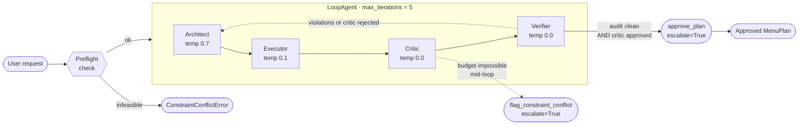

# AGEP — Autonomous Gourmet Event Planner

A four-agent **Plan-Act-Reflect** system on [Google Agent Development Kit][adk]
that plans a dinner event end-to-end. Each agent is specialized (Architect,
Executor, Critic, Verifier), each owns one concern, and together they form a
self-correcting loop with explicit budget-correction and
hallucination-prevention sub-loops.

The default backend is **Claude Code headless** — no API key needed to run
locally. Swap to Gemini or Anthropic with a single env var.

[adk]: https://google.github.io/adk-docs/

---

## Architecture



**The four agents:**

| Agent         | Temp | Tools                                    | What it does                                                                              |
|---------------|:----:|------------------------------------------|-------------------------------------------------------------------------------------------|
| **Architect** | 0.7  | *(none)*                                 | Decomposes user intent into a JSON menu plan. Creative; may need corrections.             |
| **Executor**  | 0.1  | `price_menu_plan`                        | Batch-prices every ingredient against a simulated grocery API.                            |
| **Critic**    | 0.0  | `flag_constraint_conflict`               | Validates budget + macros. Emits concrete delta-instructions on rejection.                |
| **Verifier**  | 0.0  | `audit_menu_plan`, `approve_plan`        | Zero-trust ingredient safety audit. The **only** agent that can terminate the loop.       |

**Shared state** flows through `session.state`. Each agent declares an
`output_key`; the next agent reads it via `{placeholder}` substitution in its
instruction. No direct agent-to-agent coupling.

**Two self-correction sub-loops:**

- **Budget Correction** — if the Critic rejects, it writes `delta_instructions`
  to state. The Architect reads them next iteration and re-plans.
- **Hallucination Prevention** — the Verifier's `audit_menu_plan` checks every
  ingredient against the user's dietary restrictions. Any unsafe ingredient
  forces a re-plan.

**Three termination paths:**

1. **Normal success** — Verifier calls `approve_plan`, which sets
   `escalate=True` and breaks the `LoopAgent`.
2. **Infeasible request** — either the preflight check raises
   `ConstraintConflictError` before any LLM call (cheap), or the Critic calls
   `flag_constraint_conflict` mid-loop.
3. **Iteration budget exhausted** — `main.py` raises `RuntimeError` after 5
   unsuccessful iterations.

---

## Live demo

The three scenarios below are built in. All logs are actual output captured
against the Claude Code backend with the default `sonnet` model.

### Scenario 1 — Happy path

> 6 guests · $200 · Salmon + Quinoa required · vegan + nut-allergy

Demonstrates: Iterative Loop; Verifier audit sweeping every ingredient.

```
$ python main.py --scenario happy

━━━━━━━━━━━━━━━━━━━━━━━━━━━━━━━━━━━━━━━━━━━━━━━━━━━━━━━━━━━━
 AGEP · scenario 'happy' · backend claude-code
 6 guests · $200 budget · required: Salmon, Quinoa · restrictions: vegan, nut-allergy
━━━━━━━━━━━━━━━━━━━━━━━━━━━━━━━━━━━━━━━━━━━━━━━━━━━━━━━━━━━━

Iteration 1
  architect  → drafted 4 recipes
  executor   → price_menu_plan(4 recipes, 34 ingredients)
  executor   ← $79.81 total · 0 unknown ingredients
  executor   → returned priced plan ($79.81)
  critic     → APPROVED · "Total cost of $79.81 is well within the $200 budget…"
  verifier   → audit_menu_plan(34 ingredients, [vegan, nut-allergy])
  verifier   ← APPROVED · 34 ingredients checked · 0 violations
  verifier   → approve_plan — loop exits
  verifier   ← approved=True

────────────────────────────────────────────────────────────
 Plan approved in 1 iteration · $79.81
────────────────────────────────────────────────────────────

MENU

• Mixed Greens Salad with Lemon-Dijon Vinaigrette (serves 6 · accommodates: vegan, nut-allergy)
    - 1.0 lb mixed greens         $4.00
    - 0.5 lb cherry tomatoes      $1.75
    - 2.0 count cucumber             $2.00
    - 1.0 bunch radish               $2.00
    - 2.0 count lemon                $1.50
    - 3.0 tbsp olive oil            $1.50
    - 1.0 tbsp dijon mustard        $0.30
    - 1.0 tsp sea salt             $0.05
    - 0.5 tsp black pepper         $0.07

• Lemon-Dill Baked Salmon with Capers (serves 6 · accommodates: nut-allergy)
    - 3.0 lb salmon               $36.00
    - 2.0 count lemon                $1.50
    - 1.0 bunch dill                 $1.80
    - 4.0 clove garlic               $1.00
    - 2.0 tbsp olive oil            $1.00
    - 2.0 tbsp capers               $0.80
    - 2.0 tsp sea salt             $0.10
    - 1.0 tsp black pepper         $0.15

• Herbed Quinoa Pilaf with Roasted Cherry Tomatoes (serves 6 · accommodates: vegan, nut-allergy)
    - 1.5 lb quinoa               $6.00
    - 3.0 cup vegetable broth      $0.60
    - 1.0 count onion                $0.75
    - 4.0 clove garlic               $1.00
    - 0.5 lb cherry tomatoes      $1.75
    - 1.0 bunch parsley              $1.50
    - 1.0 count lemon                $0.75
    - 2.0 tbsp olive oil            $1.00
    - 1.0 tsp cumin                $0.20
    - 1.0 tsp sea salt             $0.05
    - 0.5 tsp black pepper         $0.07

• Garlic Roasted Asparagus with Lemon (serves 6 · accommodates: vegan, nut-allergy)
    - 2.0 lb asparagus            $8.00
    - 3.0 clove garlic               $0.75
    - 2.0 tbsp olive oil            $1.00
    - 1.0 count lemon                $0.75
    - 1.0 tsp sea salt             $0.05
    - 0.5 tsp black pepper         $0.07
```

**What to notice:**
- Converged in **one iteration** — the cheap, clean path.
- `34 ingredients checked · 0 violations` — every ingredient was individually
  audited against the nut-allergy + vegan rules. The Hallucination Prevention
  Loop runs on every iteration, even when clean.
- Salmon is isolated to one dish (non-vegan but nut-safe). Three other dishes
  are fully vegan, so the vegan guest has real options.

---

### Scenario 2 — Budget Correction Loop

> Same as happy, but **$60 budget** — forces the Critic to reject and re-plan.

Demonstrates: Correction Loop with explicit delta-instructions.

```
$ python main.py --scenario budget_crunch

━━━━━━━━━━━━━━━━━━━━━━━━━━━━━━━━━━━━━━━━━━━━━━━━━━━━━━━━━━━━
 AGEP · scenario 'budget_crunch' · backend claude-code
 6 guests · $60 budget · required: Salmon, Quinoa · restrictions: vegan, nut-allergy
━━━━━━━━━━━━━━━━━━━━━━━━━━━━━━━━━━━━━━━━━━━━━━━━━━━━━━━━━━━━

Iteration 1
  architect  → drafted 3 recipes
  executor   → price_menu_plan(3 recipes, 22 ingredients)
  executor   ← $62.75 total · 0 unknown ingredients
  executor   → returned priced plan ($62.75)
  critic     → REJECTED · "Total computed cost is $62.75, which exceeds the $60.00 budget by $2.75." · 2 delta-instructions
  verifier   → audit_menu_plan(22 ingredients, [vegan, nut-allergy])
  verifier   ← APPROVED · 22 ingredients checked · 0 violations
  verifier   → APPROVED · 0 violations          ← audit clean; loop continues because critic rejected

Iteration 2
  architect  → drafted 3 recipes                 ← applied the delta instruction
  executor   → price_menu_plan(3 recipes, 22 ingredients)
  executor   ← $59.75 total · 0 unknown ingredients
  executor   → returned priced plan ($59.75)
  critic     → APPROVED · "Total computed cost is $59.75, which is within the $60.00 budget…"
  verifier   → audit_menu_plan(22 ingredients, [vegan, nut-allergy])
  verifier   ← APPROVED · 22 ingredients checked · 0 violations
  verifier   → approve_plan — loop exits
  verifier   ← approved=True

────────────────────────────────────────────────────────────
 Plan approved in 2 iterations · $59.75
────────────────────────────────────────────────────────────

MENU

• Lemon-Dill Baked Salmon (serves 6 · accommodates: nut-allergy)
    - 2.25 lb salmon               $27.00        ← reduced from 2.5 lb per Critic delta
    - 3.0 count lemon                $2.25
    - 1.0 bunch dill                 $1.80
    - 2.0 tbsp capers               $0.80
    - 3.0 tbsp olive oil            $1.50
    - 4.0 clove garlic               $1.00
    - 2.0 tsp sea salt             $0.10
    - 1.0 tsp black pepper         $0.15

• Quinoa Tabbouleh Salad (serves 6 · accommodates: vegan, nut-allergy)
    - 1.5 lb quinoa               $6.00
    - 0.5 lb cherry tomatoes      $1.75
    - 2.0 count cucumber             $2.00
    - 2.0 bunch parsley              $3.00
    - 2.0 count lemon                $1.50
    - 4.0 tbsp olive oil            $2.00
    - 1.0 tsp sea salt             $0.05
    - 1.0 tsp black pepper         $0.15

• Garlic Roasted Asparagus with Lemon (serves 6 · accommodates: vegan, nut-allergy)
    - 1.5 lb asparagus            $6.00
    - 2.0 tbsp olive oil            $1.00
    - 3.0 clove garlic               $0.75
    - 1.0 count lemon                $0.75
    - 1.0 tsp sea salt             $0.05
    - 1.0 tsp black pepper         $0.15
```

**What to notice:**
- Iteration 1: total $62.75, Critic rejects and writes two concrete
  delta-instructions to state.
- Iteration 2: Architect applies the delta literally (salmon 2.5 lb → 2.25 lb),
  landing at **$59.75** — within budget. Verifier clean → `approve_plan` →
  loop exits.
- The Verifier approved BOTH iterations; only the Critic objected. The loop
  kept going because the Verifier gates `approve_plan` on *both* its own
  audit *and* the Critic's verdict being approved.

---

### Scenario 3 — Human Escalation (preflight)

> 20 guests · $10 budget — mathematically infeasible before any agent runs.

Demonstrates: `ConstraintConflictError` short-circuiting the loop.

```
$ python main.py --scenario impossible

━━━━━━━━━━━━━━━━━━━━━━━━━━━━━━━━━━━━━━━━━━━━━━━━━━━━━━━━━━━━
 AGEP · scenario 'impossible' · backend claude-code
 20 guests · $10 budget · required: — · restrictions: —
━━━━━━━━━━━━━━━━━━━━━━━━━━━━━━━━━━━━━━━━━━━━━━━━━━━━━━━━━━━━

ConstraintConflictError: Budget of $10.00 for 20 guests = $0.50/guest,
below the floor of $8.00/guest. Constraints are mathematically infeasible.
```

**What to notice:**
- Zero LLM calls. Zero tokens spent. The preflight catches the impossibility
  before the `LoopAgent` is even constructed. That's the cheap escalation
  path. The Critic has a mirror tool (`flag_constraint_conflict`) for cases
  that only become obviously-impossible mid-loop.

---

### Hallucination Prevention — the Verifier's audit in detail

You can see `audit_menu_plan` in every scenario's event stream. On a clean
run it reports:

```
  verifier   ← APPROVED · 34 ingredients checked · 0 violations
```

34 individual ingredient checks against the user's dietary restrictions. The
audit applies two different rules depending on the restriction type:

- **Global exclusions** (allergies like `nut-allergy`, `gluten-free`,
  `dairy-free`): NO dish may contain the allergen (cross-contamination).
- **Per-guest preferences** (`vegan`, `vegetarian`): at least ONE dish must
  be fully compliant; others may be non-compliant.

If a violation is found (e.g. the Architect reached for `almond flour` in a
vegan dish while `nut-allergy` was in effect), the event line reads:

```
  verifier   ← REJECTED · 1 violation of 34 checked
```

…and the underlying tool payload carries the detail:

```json
{
  "status": "rejected",
  "violations": [
    "'almond flour' in 'Vegan Almond Crust Tart' contains ['nuts'] — violates 'nut-allergy' (affects every guest)."
  ],
  "audited_count": 34
}
```

The Verifier mirrors that into state as `verification`, the LoopAgent runs
again, and the Architect sees the exact offending ingredients on the next
iteration — the Hallucination Prevention Loop.

---

## Quickstart

### Default — Claude Code (no API key)

```bash
git clone https://github.com/<your-username>/agep.git
cd agep
python -m venv .venv && source .venv/bin/activate
pip install -r requirements.txt
python main.py --scenario happy
```

The `claude-agent-sdk` package ships a bundled Claude Code CLI and reuses
your local auth. No key configuration required.

### Anthropic API key

```bash
pip install "google-adk[extensions]"     # adds LiteLLM support
export ANTHROPIC_API_KEY=sk-ant-...
python main.py --scenario happy --backend anthropic
```

### Google Gemini API key

```bash
export GOOGLE_API_KEY=...
python main.py --scenario happy --backend gemini
```

### CLI reference

```
usage: agep [-h] [--scenario {budget_crunch,happy,impossible}]
            [--backend {claude-code,anthropic,gemini}]
            [--model MODEL] [--verbose]
```

| Flag         | Default       | Purpose                                                          |
|--------------|---------------|------------------------------------------------------------------|
| `--scenario` | `happy`       | Built-in scenario selector.                                      |
| `--backend`  | `claude-code` | Overrides `AGEP_LLM`.                                            |
| `--model`    | backend-specific | Overrides `AGEP_MODEL`. `sonnet`, `opus`, `gemini-2.5-pro`, … |
| `--verbose`  | off           | DEBUG logs from ADK and the adapter.                             |

Set `AGEP_DEBUG=1` to stream the Claude Code subprocess stderr to your
terminal — useful when debugging the adapter itself.

---

## Code map

```
agep/
├── README.md          # You are here
├── requirements.txt
├── .env.example       # Backend selector + optional API keys
├── state.py           # Pydantic models: EventConstraints, MenuPlan, Critique, SafetyAudit
├── tools.py           # Simulated grocery/nutrition DBs + escalation hooks
├── llm.py             # Pluggable backend selector + ClaudeCodeLlm BaseLlm adapter
├── agents.py          # 4 LlmAgents + the LoopAgent(max_iterations=5)
└── main.py            # CLI + preflight + Runner + pretty-printer
```

Five files, ~1800 lines, no magic. Each file's top-of-module docstring
explains its scope.

---

## How the Claude Code backend works

Google ADK is Gemini-first, but it exposes a clean abstract base class called
`BaseLlm` you can subclass to bring any model backend. `llm.py::ClaudeCodeLlm`
implements that interface on top of the `claude-agent-sdk` Python package,
routing each ADK `LlmRequest` into a Claude Code subprocess.

Three details worth highlighting:

1. **Prompt-level tool orchestration.** Claude Code doesn't speak ADK's
   native tool-use protocol, so the adapter serializes tool schemas into the
   system prompt and asks Claude to respond with a JSON envelope:
   `{"action": "tool_call", "tool_name": "...", "arguments": {...}}` or
   `{"action": "text", "content": "..."}`. The adapter parses that back into
   the `Content`/`Part` structure ADK expects. Less robust than native
   function-calling, but it's what buys the no-API-key story.

2. **Tools are framed as "functions", never as "tools".** If the system
   prompt mentions "tools", Claude Code attempts real tool execution and the
   subprocess crashes. The adapter carefully describes them as *"external
   functions to request via JSON"*.

3. **Temperature is a soft hint.** The CLI does not expose a temperature
   flag, so the adapter prepends a style directive to the system prompt
   (`0.0 → "Be strictly deterministic"`, `0.7 → "Be creative"`). For precise
   temperature control, route through the `anthropic` (LiteLLM) or `gemini`
   backend.

---

## Extending

**Swap in a real grocery API** — replace `price_menu_plan` in `tools.py` with
a call to Kroger / Instacart / USDA. Agent code doesn't change; that's the
point of the tool abstraction.

**Add dietary restrictions** — edit `_RESTRICTION_BLOCKS`,
`_GLOBAL_EXCLUSIONS`, and `_PER_GUEST_PREFERENCES` in `tools.py`.

**Persist sessions** — swap `InMemoryRunner` for a persistent `SessionService`
(e.g. `VertexAiSessionService`).

**Add pytest** — the three scenarios are dispatch-ready for pytest; assert on
`plan_approved=True`, `total_cost_usd <= budget`, and that
`ConstraintConflictError` fires for `impossible`.

---

## Requirements

- Python 3.10+
- One of:
  - Claude Code installed and authenticated locally (default), OR
  - `ANTHROPIC_API_KEY` + `google-adk[extensions]`, OR
  - `GOOGLE_API_KEY`
