# AGEP — Autonomous Gourmet Event Planner

> A six-agent system that turns a dinner-party request into a printable booklet — priced menu, step-by-step cooking instructions, and AI-plated dish photography — with a built-in red team that catches what a deterministic safety check can't.

<p align="center">
  <video src="docs/agep-demo.mp4" controls width="80%" muted playsinline></video>
</p>

<p align="center">
  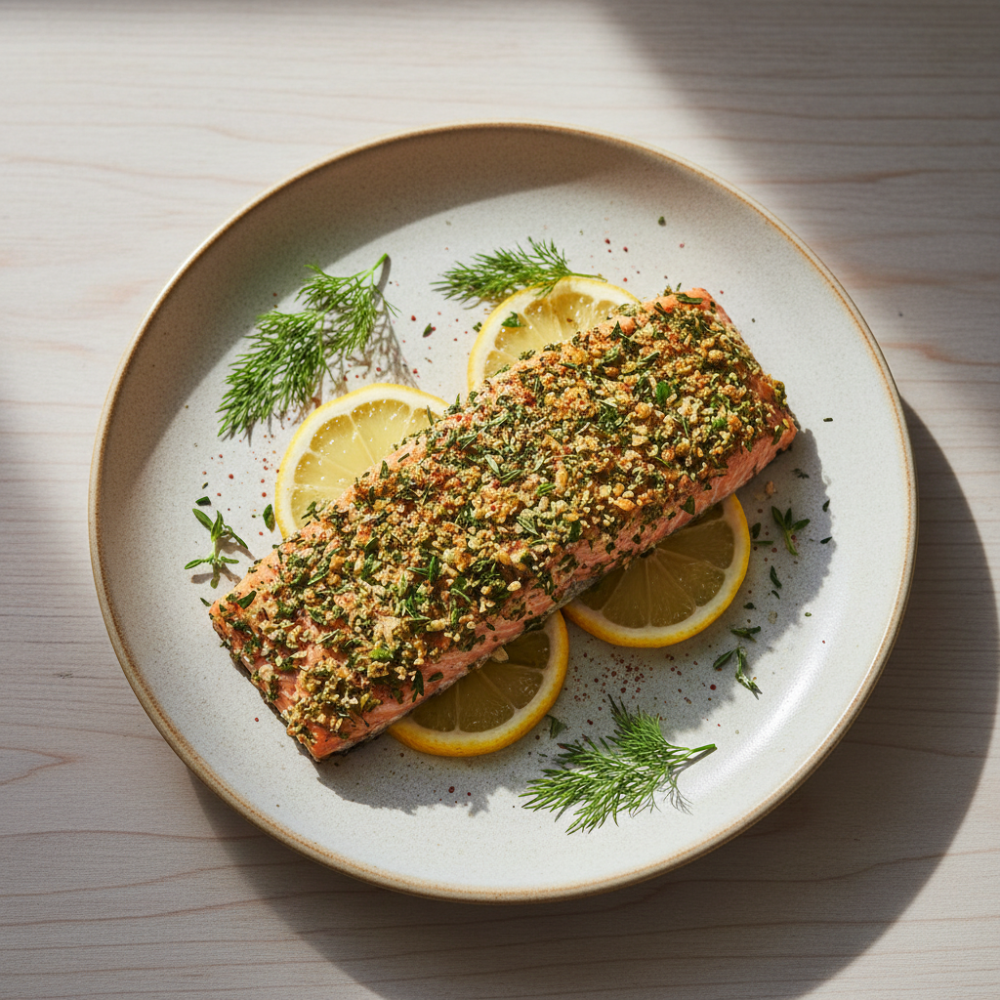
  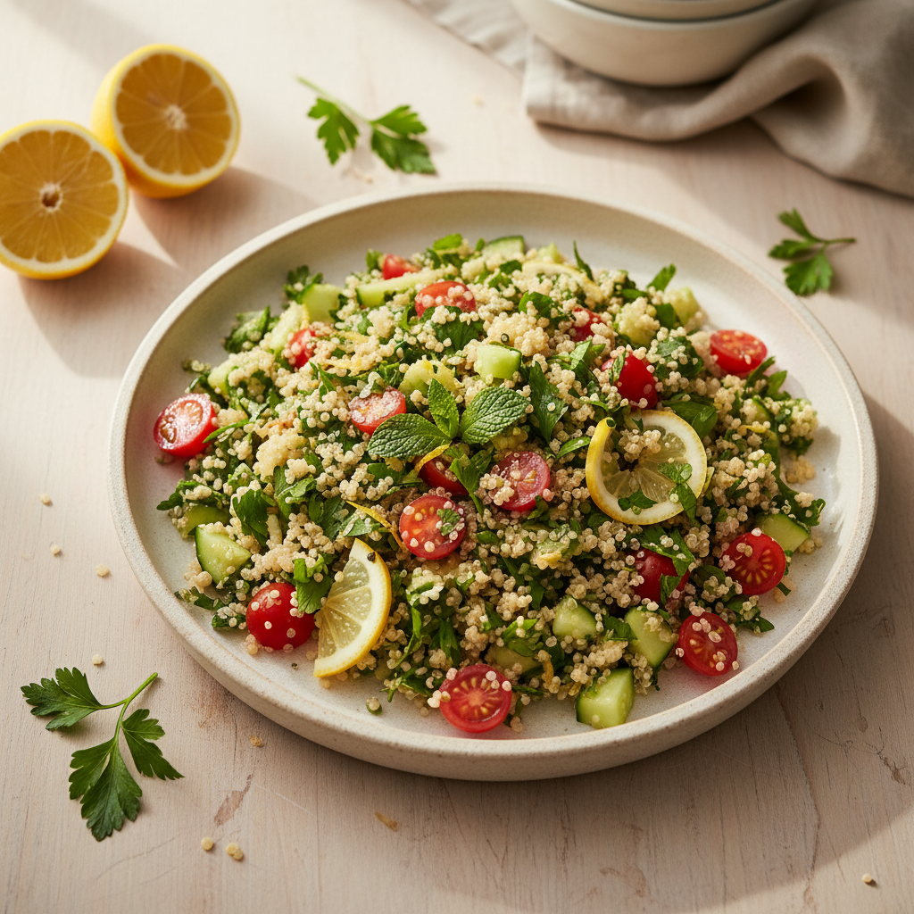
  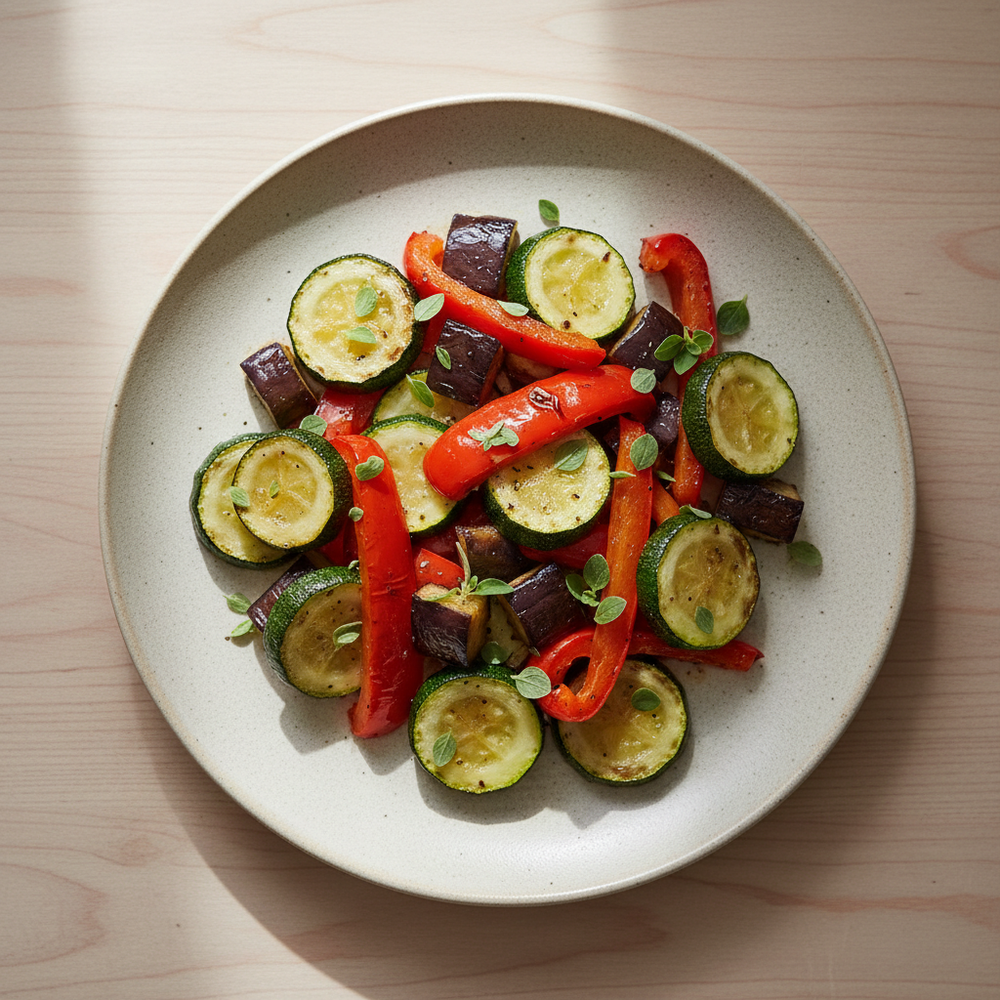
  
</p>

<p align="center"><em>One run, one prompt, one approved menu, four dishes. Defaults to Claude Code locally — no API key needed.</em></p>

## What it does

- Plans full menus respecting dietary restrictions, budget, kitchen equipment, prep-time ceilings, and calorie / protein floors
- Runs a five-agent safety loop with adversarial consensus before any plan is approved
- Writes step-by-step cooking instructions for the approved menu in a separate, isolated runner
- Optionally prices ingredients via Spoonacular and plates each dish via Gemini image generation

---

## Architecture


```mermaid
flowchart LR
    user([User request]) --> preflight{{Preflight<br/>check}}
    preflight -- infeasible --> conflict([ConstraintConflictError])
    preflight -- ok --> loop

    subgraph loop ["LoopAgent · max_iterations = 5"]
        direction LR
        architect[Architect<br/>temp 0.7] --> executor[Executor<br/>temp 0.1]
        executor --> critic[Critic<br/>temp 0.0]
        critic --> verifier[Verifier<br/>temp 0.0]
        verifier --> saboteur[Saboteur<br/>temp 0.7]
    end

    saboteur -- consensus:<br/>verifier clean<br/>AND critic approved<br/>AND no loophole --> approve([approve_plan<br/>escalate=True])
    critic -. budget impossible<br/>mid-loop .-> abort([flag_constraint_conflict<br/>escalate=True])
    saboteur -. loophole found<br/>OR critic rejected .-> architect

    approve --> result([Approved MenuPlan])
```

| Agent         | Temp | Stage     | Tools                                                            | Job |
|---------------|:----:|-----------|------------------------------------------------------------------|-----|
| **Architect** | 0.7  | in-loop   | —                                                                | Decomposes intent into a JSON menu plan with `prep_minutes` + `required_equipment` per recipe |
| **Executor**  | 0.1  | in-loop   | `price_menu_plan`                                                | Batch-prices every ingredient (simulated DB or Spoonacular) |
| **Critic**    | 0.0  | in-loop   | `validate_nutrition_macros`, `check_equipment`, `validate_prep_time`, `flag_constraint_conflict` | Validates budget + macros + equipment + prep time; emits delta-instructions on rejection |
| **Verifier**  | 0.0  | in-loop   | `audit_menu_plan`                                                | Deterministic ingredient audit against known restriction categories |
| **Saboteur**  | 0.7  | in-loop   | `approve_plan`                                                   | Red-team adversary; hunts loopholes the deterministic audit can't see; gates approval |
| **Chef**      | 0.2  | post-loop | —                                                                | Writes step-by-step cooking instructions for the approved menu, in its own runner |

Shared state flows through `session.state`. Each agent declares an `output_key`; the next reads it via `{placeholder}` substitution. Approval requires a two-vote consensus — Verifier clean AND Saboteur clean — and the loop is hard-capped at 5 iterations.

<details>
<summary><b>Self-correction sub-loops</b></summary>

- **Budget / Operational Correction** — if the Critic rejects (over budget, missing equipment, prep over ceiling, macros below floor), it writes `delta_instructions` to state. The Architect reads them next iteration and re-plans.
- **Hallucination Prevention** — the Verifier's `audit_menu_plan` checks every ingredient against the user's dietary restrictions. Any unsafe ingredient forces a re-plan.
- **Adversarial Consensus** — the Saboteur reads the Verifier's verdict and tries to attack it. If it finds a credible loophole the tool missed, it writes a `SaboteurReport` to state; the Architect applies the `proposed_fix` on the next iteration.

</details>

<details>
<summary><b>Termination paths</b></summary>

1. **Normal success** — Saboteur calls `approve_plan` with `escalate=True`, breaking the `LoopAgent`. Requires Critic approved AND Verifier audit clean AND Saboteur found no loophole. Once the loop exits, `main.py` runs the Chef and (if configured) image gen.
2. **Infeasible request** — either the preflight raises `ConstraintConflictError` before any LLM call (cheap), or the Critic calls `flag_constraint_conflict` mid-loop. Chef does not run on this path.
3. **Iteration budget exhausted** — `main.py` raises `RuntimeError` after 5 unsuccessful iterations. Chef does not run on this path either.

</details>

After the loop terminates with an approved plan, control passes to a second, independent runner:


```mermaid
flowchart LR
    approved([Approved MenuPlan]) --> chef_runner

    subgraph chef_runner ["InMemoryRunner · own session"]
        chef[Chef<br/>temp 0.2]
    end

    chef --> script([CookingScript])
    approved -. recipes .-> images{{Image gen<br/>optional}}
    images -- GOOGLE_API_KEY set --> pngs([PNGs in generated/])
    images -- not configured --> skip([no-op, skipped])
    script --> booklet([Printed booklet:<br/>menu + prices +<br/>instructions + images])
    pngs --> booklet
    skip --> booklet
```

---

## What it validates

The Critic is a full operational gate, not just a budget watchdog. Three opt-in tools cover equipment, prep time, and macros in addition to budget:

| Constraint   | Tool                                                 | Default when constraint is unset |
|--------------|------------------------------------------------------|----------------------------------|
| Budget       | inline check against grounded plan total             | always enforced                  |
| Equipment    | `check_equipment(plan, available)`                   | skipped (empty `kitchen_equipment` list) |
| Prep time    | `validate_prep_time(plan, max_minutes)`              | skipped (`max_prep_minutes=None`) |
| Macros       | `validate_nutrition_macros(plan, guests, kcal, g)`   | skipped (floors `None`)          |

Each tool returns a structured pass/fail with concrete delta hints. The Critic prompt runs them in fixed order (budget → macros → equipment → prep time), aggregates every violation into one `Critique`, and emits one delta-instruction list. The Architect re-plans with the deltas in hand.

### Cooking instructions, in isolation

After the loop approves, `main.py` constructs a brand-new `InMemoryRunner` for a single agent — the Chef — with a fresh session containing only the approved `grounded_plan`. The Chef writes a `CookingScript`: per-recipe atomic imperative steps with temperatures, timing, and ingredient quantities pulled from the plan.

The Chef runs in its own runner **on purpose**. The deliberate property: no Chef output — malformed JSON, missing recipes, hallucinated steps, nothing — can retroactively invalidate or modify a menu the safety loop already approved. If the Chef call raises, `main.py` catches the exception, prints `chef → ERROR · …`, and renders the menu without steps. `--no-chef` skips the stage entirely.

### Optional integrations

<details>
<summary><b>Spoonacular grocery pricing</b> — flip one env var, swap the simulated DB for live HTTP pricing</summary>

```bash
pip install requests
export AGEP_GROCERY=spoonacular
export SPOONACULAR_API_KEY=...
```

The Executor's `price_menu_plan` tool dispatches on `AGEP_GROCERY`. Both backends honour the same return contract (`grounded_plan`, `unknown_ingredients`, `source`), so no agent prompt changes when you flip the env var. The Spoonacular adapter caches name→ID lookups and per-line price results in process — a session with repeated ingredients (olive oil in four recipes) costs one search and one price call rather than eight. Single-ingredient failures mark `unknown` and let the loop continue. Free tier: 150 requests/day.

</details>

<details>
<summary><b>Gemini dish images</b> — one PNG per recipe, generated post-loop, written to <code>generated/&lt;scenario&gt;/</code></summary>

```bash
pip install google-genai
export GOOGLE_API_KEY=...
```

When `GOOGLE_API_KEY` is set and `google-genai` is installed, `images.generate_dish_images` runs once after the Chef stage, asks Gemini (default `gemini-2.5-flash-image-preview`, override with `AGEP_IMAGE_MODEL`) for one PNG per recipe, and writes them to `generated/<scenario>/`. The booklet then prints `Image: <path>` next to each dish. If the key is missing or the package isn't installed, the function returns `{"status": "skipped", "reason": "..."}`. There is no crash path — image gen is a pure garnish. `--no-images` skips even when configured.

</details>

---

## See it run

### Scenario: a vegan + nut-allergy dinner for six

> 6 guests · $200 budget · Salmon + Quinoa required · vegan + nut-allergy

```
$ python main.py --scenario happy

━━━━━━━━━━━━━━━━━━━━━━━━━━━━━━━━━━━━━━━━━━━━━━━━━━━━━━━━━━━━
 AGEP · scenario 'happy' · backend claude-code
 6 guests · $200 budget · required: Salmon, Quinoa · restrictions: vegan, nut-allergy
━━━━━━━━━━━━━━━━━━━━━━━━━━━━━━━━━━━━━━━━━━━━━━━━━━━━━━━━━━━━

Iteration 1
  architect  → drafted 4 recipes
  executor   → price_menu_plan(4 recipes, 34 ingredients)
  executor   ← $86.69 total · 0 unknown · source=simulated
  executor   → returned priced plan ($86.69)
  critic     → APPROVED · "all checks passed"
  verifier   → audit_menu_plan(34 ingredients, [vegan, nut-allergy])
  verifier   ← APPROVED · 34 ingredients checked · 0 violations
  verifier   → APPROVED · 0 violations
  saboteur   → approve_plan — loop exits
  saboteur   ← approved=True
  saboteur   → CLEAR · "Audited all 34 ingredients across 4 recipes against the full threat model: no hidden alle…"

Chef
  chef       → wrote instructions for 4 recipes

────────────────────────────────────────────────────────────
 Plan approved in 1 iteration · $86.69 · 115 min prep
────────────────────────────────────────────────────────────
```

> REQUIRED INGREDIENTS: Salmon anchors the main course (3 lb for 6 guests); Quinoa forms the base of the tabbouleh side. NUT ALLERGY (global): every recipe has been scrubbed of all tree-nut and peanut-adjacent pantry items — almonds, walnuts, pine nuts, cashew cream, and almond flour are absent from the entire menu. VEGAN (per-guest preference): three of the four dishes (Quinoa Tabbouleh, Roasted Vegetables, Warm Chickpeas with Spinach) are fully plant-based, giving vegan guests a complete, balanced meal. The salmon main is intentionally non-vegan to leverage the required ingredient. KITCHEN EQUIPMENT: kitchen_equipment list was empty, so a standard home kitchen (oven, stovetop, mixing bowl) is assumed — all recipes use only these. BUDGET: estimated spend is well under $100, leaving ample headroom within the $200 ceiling.

#### Menu

**Herb-Baked Salmon with Lemon, Dill & Smoked Paprika** &nbsp;·&nbsp; *serves 6 · accommodates: nut-allergy · 30 min · oven, mixing bowl*


| Ingredient | Qty | Price |
|---|---|---|
| Salmon | 3.0 lb | $36.00 |
| Olive oil | 4.0 tbsp | $2.00 |
| Garlic | 4.0 clove | $1.00 |
| Dill | 1.0 bunch | $1.80 |
| Thyme | 1.0 bunch | $2.00 |
| Lemon | 2.0 count | $1.50 |
| Smoked paprika | 1.0 tsp | $0.25 |
| Sea salt | 1.0 tsp | $0.05 |
| Black pepper | 1.0 tsp | $0.15 |

**Instructions:**
1. Preheat oven to 400 F.
2. Mince 4 garlic cloves.
3. Strip leaves from 1 bunch of dill and 1 bunch of thyme, then finely chop both.
4. Juice 1 lemon into a mixing bowl; slice the second lemon into thin rounds and set aside.
5. Add 4 tbsp olive oil, minced garlic, chopped dill, chopped thyme, 1 tsp smoked paprika, 1 tsp sea salt, and 1 tsp black pepper to the bowl with the lemon juice; stir until a uniform marinade forms.
6. Line a rimmed baking sheet with foil or parchment and place the 3 lb salmon skin-side down on it.
7. Spread the herb marinade evenly over the entire top surface of the salmon.
8. Arrange the lemon rounds in a single layer on top of the coated salmon.
9. Bake on the center rack for 20–25 minutes until the thickest part flakes easily with a fork and registers an internal temperature of 145 F.
10. Remove from the oven and rest undisturbed for 5 minutes.
11. Slice into 6 equal portions, spoon any accumulated pan juices over each piece, and transfer to a serving platter.

---

**Lemon-Herb Quinoa Tabbouleh** &nbsp;·&nbsp; *serves 6 · accommodates: vegan, nut-allergy · 30 min · stovetop, mixing bowl*


1.5 lb quinoa · 3 cup vegetable broth · 1 lb cherry tomatoes · 2 cucumber · 1 bunch parsley · 2 lemon · 3 tbsp olive oil · salt · pepper

---

**Roasted Zucchini, Bell Pepper & Eggplant with Oregano** &nbsp;·&nbsp; *serves 6 · accommodates: vegan, nut-allergy · 35 min · oven, mixing bowl*


3 zucchini · 3 bell pepper · 1 lb eggplant · 3 tbsp olive oil · 4 clove garlic · 1 bunch oregano · salt · pepper

---

**Warm Cumin Chickpeas with Spinach and Lemon** &nbsp;·&nbsp; *serves 6 · accommodates: vegan, nut-allergy · 20 min · stovetop*


1.5 lb chickpeas · 1 lb spinach · 2 lemon · 2 tbsp olive oil · 3 clove garlic · 1 tsp cumin · chili flakes · salt

*(Chef writes step-by-step instructions for every dish; the other three are similar.)*

#### What to notice

- **One iteration, every gate clears**: Critic on `"all checks passed"`, Verifier 0 violations on 34 ingredients, Saboteur straight to `approve_plan`.
- **Each recipe header carries operational metadata** — `prep_minutes` and `required_equipment` are written by the Architect and consumed by the Critic's tools in the constrained scenarios below.
- **`Chef` is its own stage, post-loop**: `chef → wrote instructions for 4 recipes`. If Chef had crashed, the booklet would still print without steps.
- **The receipt summary reports cost AND prep time** — `$86.69 · 115 min prep`.

### Other scenarios

<details>
<summary><b>Budget Correction Loop</b> — Critic rejects a $64.84 plan, Architect re-plans within $60 budget</summary>

> 6 guests · **$60 budget** · Salmon + Quinoa required · vegan + nut-allergy

<p align="center">
  
  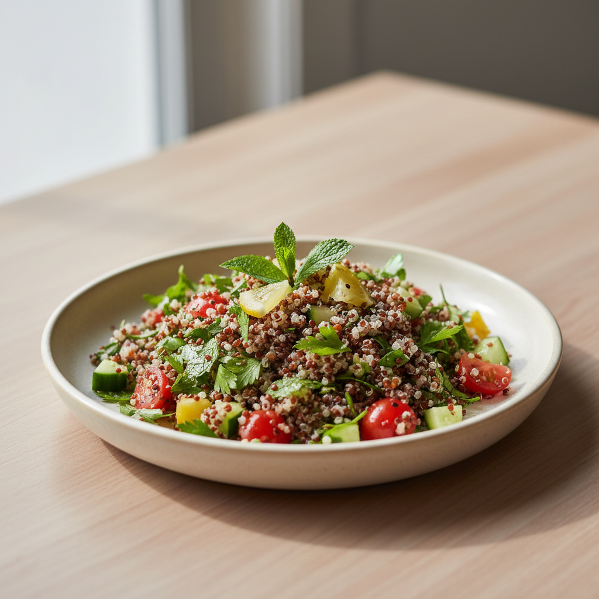
  
</p>

```
Iteration 1
  architect  → drafted 3 recipes
  executor   → price_menu_plan(3 recipes, 23 ingredients)
  executor   ← $64.84 total · 0 unknown · source=simulated
  executor   → returned priced plan ($64.84)
  critic     → REJECTED · "Total cost of $64.84 exceeds the $60.00 budget by $4.84." · 5 delta-instructions
  verifier   → audit_menu_plan(23 ingredients, [vegan, nut-allergy])
  verifier   ← APPROVED · 23 ingredients checked · 0 violations
  verifier   → APPROVED · 0 violations
  saboteur   → LOOPHOLE · "plan rejected by Critic"

Iteration 2
  architect  → drafted 3 recipes
  executor   → price_menu_plan(3 recipes, 23 ingredients)
  executor   ← $56.34 total · 0 unknown · source=simulated
  executor   → returned priced plan ($56.34)
  critic     → APPROVED · "all checks passed"
  verifier   → audit_menu_plan(23 ingredients, [vegan, nut-allergy])
  verifier   ← APPROVED · 23 ingredients checked · 0 violations
  verifier   → APPROVED · 0 violations
  saboteur   → approve_plan — loop exits
  saboteur   ← approved=True

Chef
  chef       → wrote instructions for 3 recipes

────────────────────────────────────────────────────────────
 Plan approved in 2 iterations · $56.34 · 75 min prep
────────────────────────────────────────────────────────────
```

**Approved menu** (under $60):
- Pan-Seared Salmon with Dill, Capers & Lemon — 25 min · $32.35
- Quinoa Tabbouleh Salad — 30 min · $14.37
- Roasted Asparagus with Garlic & Lemon — 20 min · $9.62

**What to notice**: Iteration 1's $64.84 produces **5 granular delta-instructions** — each cost lever becomes its own actionable delta. The Saboteur explicitly defers to the Critic on budget rejections (`LOOPHOLE: "plan rejected by Critic"`) — the red-teamer won't rubber-stamp a plan the budget auditor has already rejected. Iteration 2 pulls three cost levers simultaneously (salmon 2.5 → 2.0 lb, quinoa 1.5 → 1.25 lb, parsley 2 → 1 bunch) and lands at $56.34.

</details>

<details>
<summary><b>Hidden Gluten</b> — Saboteur catches malt-vinegar cross-contamination the Verifier's tool can't see</summary>

> 6 guests · $150 · **rolled oats required** · **gluten-free**

<p align="center">
  
  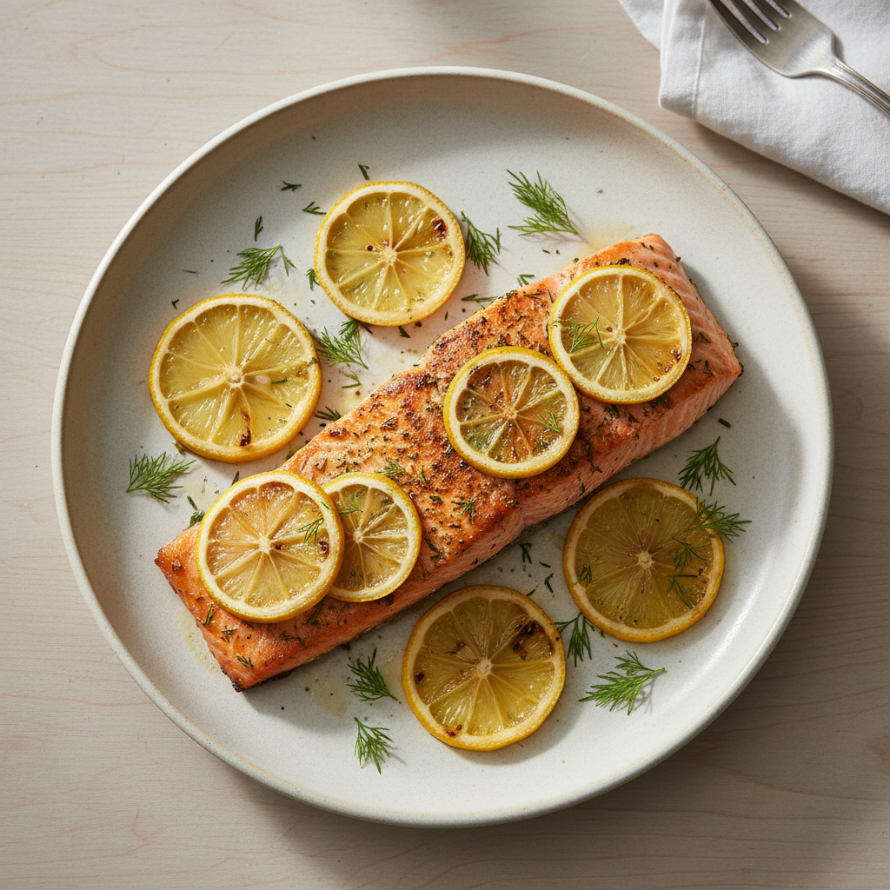
  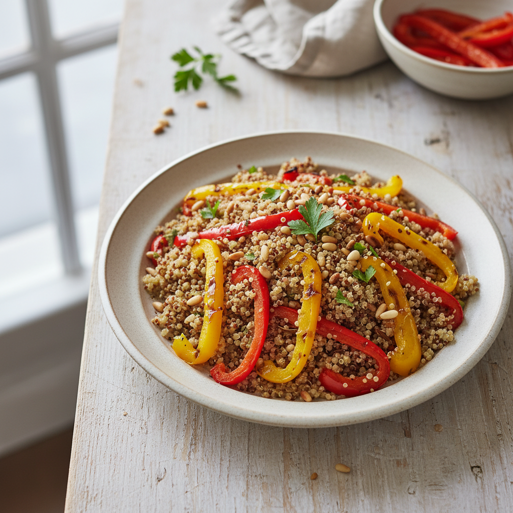
  
  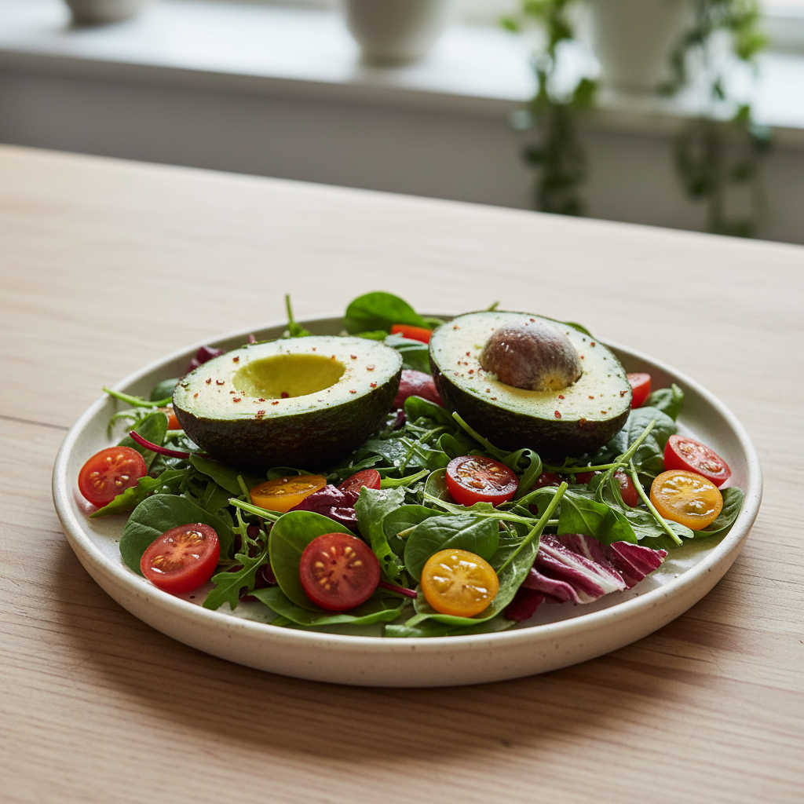
</p>

```
Iteration 1
  architect  → drafted 5 recipes
  executor   → price_menu_plan(5 recipes, 39 ingredients)
  executor   ← $73.03 total · 0 unknown · source=simulated
  executor   → returned priced plan ($73.03)
  critic     → APPROVED · "all checks passed"
  verifier   → audit_menu_plan(39 ingredients, [gluten-free])
  verifier   ← APPROVED · 39 ingredients checked · 0 violations
  verifier   → APPROVED · 0 violations
  saboteur   → LOOPHOLE · "The Avocado and Mixed Greens Salad calls for 'vinegar' with no type specified; malt vineg…"

Iteration 2
  architect  → drafted 5 recipes
  executor   → price_menu_plan(5 recipes, 39 ingredients)
  executor   ← $73.03 total · 0 unknown · source=simulated
  executor   → returned priced plan ($73.03)
  critic     → APPROVED · "all checks passed"
  verifier   → audit_menu_plan(39 ingredients, [gluten-free])
  verifier   ← APPROVED · 39 ingredients checked · 0 violations
  verifier   → APPROVED · 0 violations
  saboteur   → approve_plan — loop exits
  saboteur   ← approved=True

────────────────────────────────────────────────────────────
 Plan approved in 2 iterations · $73.03 · 165 min prep
────────────────────────────────────────────────────────────
```

**This is the core thesis of Adversarial Consensus.**

The Verifier's `audit_menu_plan` *approved on both iterations* — and that's not a bug. The deterministic tool faithfully reported what it knew: a generic ingredient name like `vinegar` has no `gluten` tag in `_NUTRITION_DB`, so it has no basis to flag it. A celiac guest relying on the deterministic audit alone could have been served malt vinegar.

The **Saboteur** caught it on iteration 1: *"The Avocado and Mixed Greens Salad calls for 'vinegar' with no type specified; malt vinegar is derived from barley and contains gluten."* The Architect read `saboteur_report` on iteration 2 and added explicit sourcing caveats for both the vinegar AND the rolled oats (correctly generalising the cross-contamination risk). Saboteur verifies the mitigations are documented, calls `approve_plan`, loop exits.

Either gate alone ships a broken menu. Together they ship a safe one.

</details>

<details>
<summary><b>Weeknight</b> — equipment + prep-time validators fire in iteration 1</summary>

> 4 guests · $80 · **chicken breast** required · equipment = stovetop + sheet pan + mixing bowl · **max prep 45 min**

<p align="center">
  
  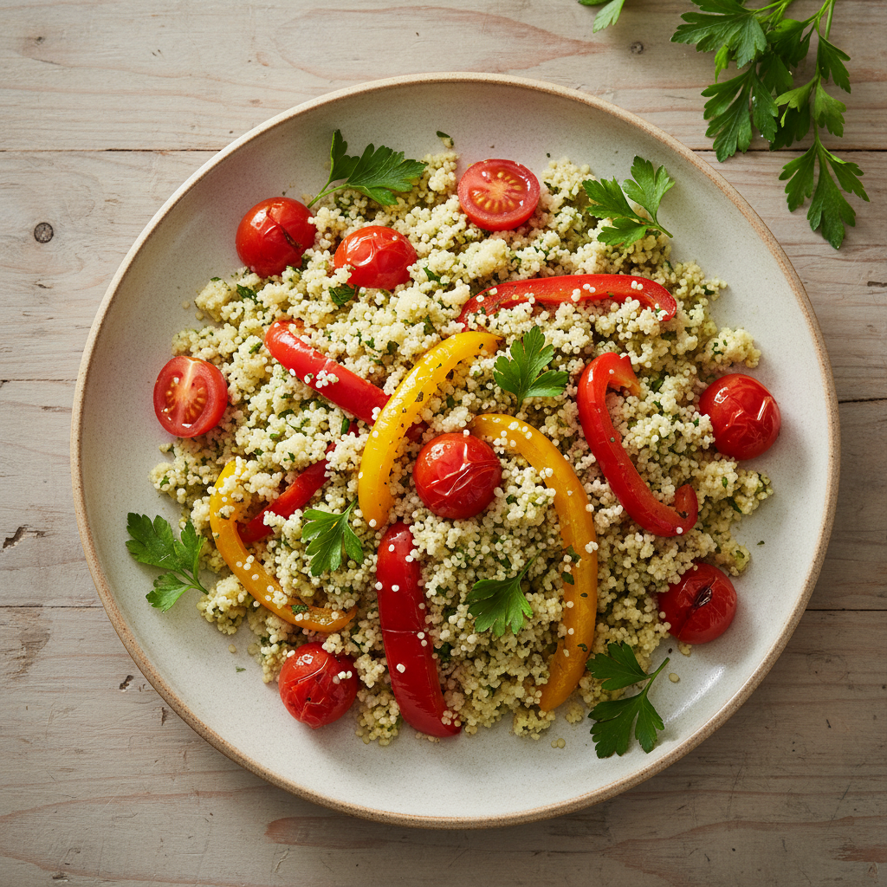
  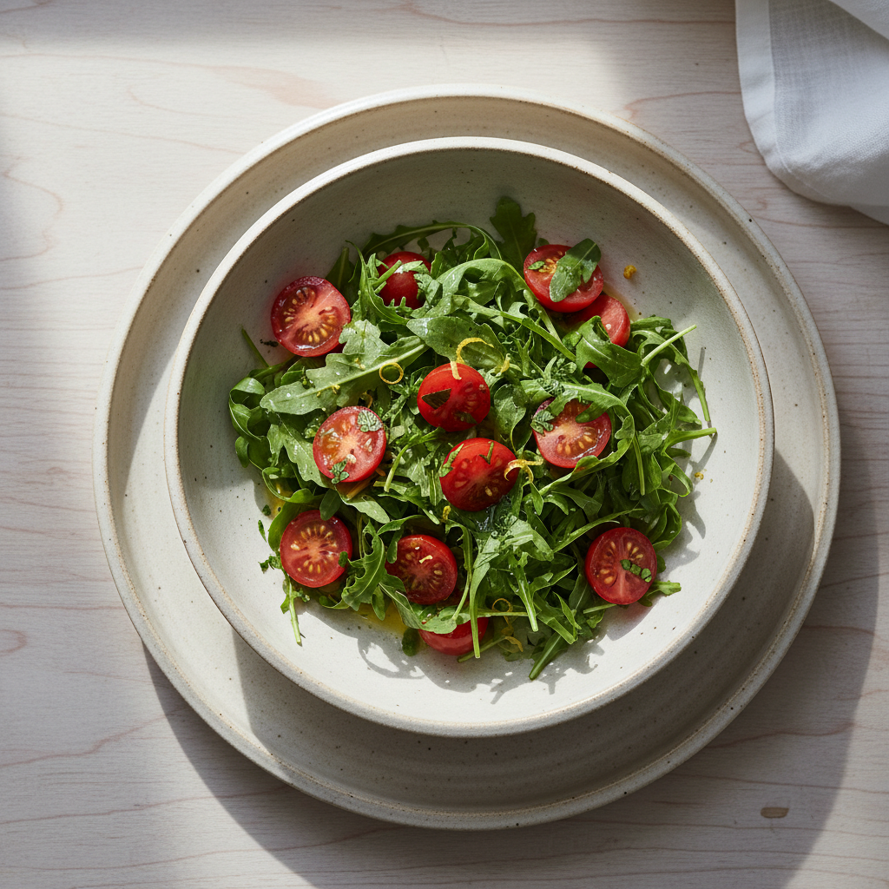
</p>

```
Iteration 1
  architect  → drafted 3 recipes
  executor   → price_menu_plan(3 recipes, 23 ingredients)
  executor   ← $30.72 total · 0 unknown · source=simulated
  executor   → returned priced plan ($30.72)
  critic     → check_equipment(available=[stovetop, sheet pan, mixing bowl])
  critic     ← APPROVED · all equipment available
  critic     → validate_prep_time(max=45 min)
  critic     ← APPROVED · 42 min total prep
  critic     → APPROVED · "all checks passed"
  verifier   → audit_menu_plan(23 ingredients, [])
  verifier   ← APPROVED · 23 ingredients checked · 0 violations
  verifier   → APPROVED · 0 violations
  saboteur   → approve_plan — loop exits
  saboteur   ← approved=True

────────────────────────────────────────────────────────────
 Plan approved in 1 iteration · $30.72 · 42 min prep
────────────────────────────────────────────────────────────
```

**What to notice**: the headline lines are the two new tool calls in the Critic's trace — `check_equipment(available=[stovetop, sheet pan, mixing bowl])` and `validate_prep_time(max=45 min)`. Both clear in iteration 1: every recipe's `required_equipment` is a subset of the available list, and the sum of `prep_minutes` is **42 min** against the 45-min ceiling. The Architect respected both constraints on the first try — no oven-roasted dishes, no blender purées, no slow braises.

</details>

<details>
<summary><b>Macro Floor</b> — nutrition validator confirms 1324 kcal / 68.7 g protein per guest</summary>

> 4 guests · $120 · **salmon** required · nut-allergy · **kcal floor 700/guest · protein floor 40 g/guest**

<p align="center">
  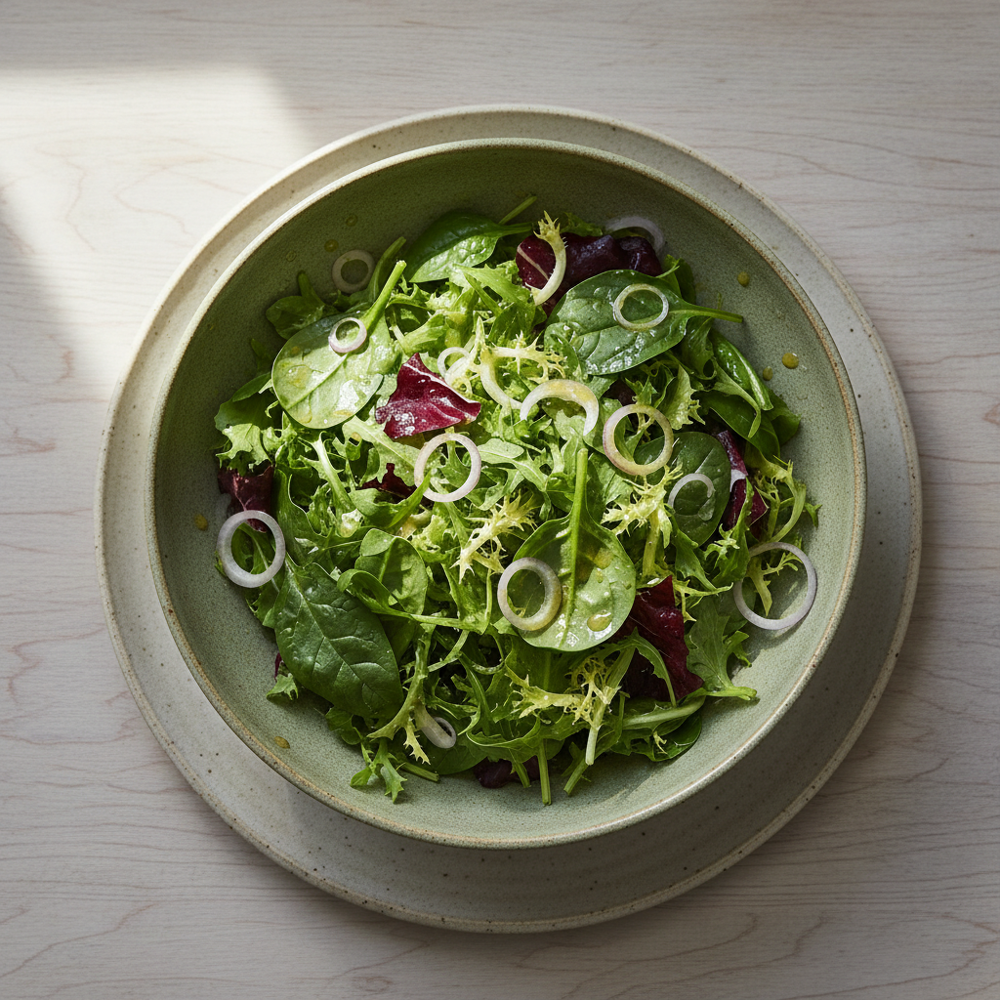
  
  
  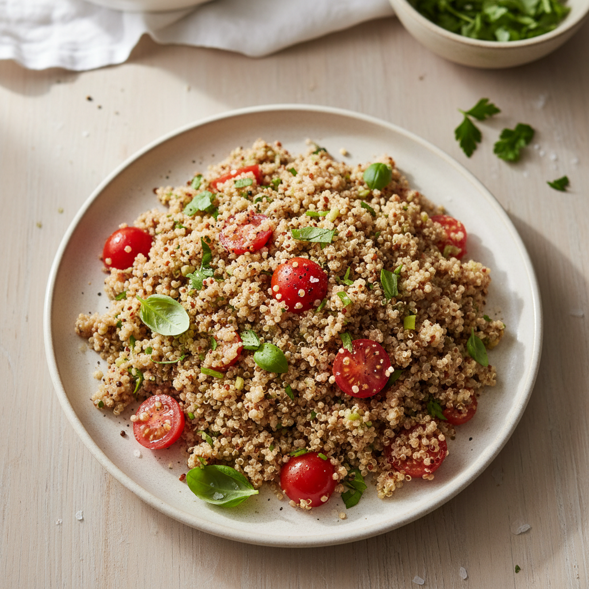
</p>

```
Iteration 1
  architect  → drafted 4 recipes
  executor   → price_menu_plan(4 recipes, 37 ingredients)
  executor   ← $64.14 total · 0 unknown · source=simulated
  executor   → returned priced plan ($64.14)
  critic     → validate_nutrition_macros(guests=4, kcal_floor=700, protein_floor=40g)
  critic     ← APPROVED · 1324 kcal/guest · 68.7 g protein/guest
  critic     → APPROVED · "all checks passed"
  verifier   → audit_menu_plan(37 ingredients, [nut-allergy])
  verifier   ← APPROVED · 37 ingredients checked · 0 violations
  verifier   → APPROVED · 0 violations
  saboteur   → approve_plan — loop exits
  saboteur   ← approved=True

────────────────────────────────────────────────────────────
 Plan approved in 1 iteration · $64.14 · 85 min prep
────────────────────────────────────────────────────────────
```

**What to notice**: the macro tool returns `1324 kcal/guest · 68.7 g protein/guest` — comfortably over both floors. The tool aggregates calories and protein from `_NUTRITION_DB` across all four recipes and divides by guest count. Equipment and prep-time tools don't fire here because this scenario leaves those constraints unset — each Critic check is opt-in.

</details>

<details>
<summary><b>Impossible</b> — preflight rejects a $10 budget for 20 guests, zero LLM calls</summary>

> 20 guests · $10 budget — mathematically infeasible before any agent runs.

```
$ python main.py --scenario impossible

━━━━━━━━━━━━━━━━━━━━━━━━━━━━━━━━━━━━━━━━━━━━━━━━━━━━━━━━━━━━
 AGEP · scenario 'impossible' · backend claude-code
 20 guests · $10 budget · required: — · restrictions: —
━━━━━━━━━━━━━━━━━━━━━━━━━━━━━━━━━━━━━━━━━━━━━━━━━━━━━━━━━━━━

ConstraintConflictError: Budget of $10.00 for 20 guests = $0.50/guest, below the floor of $8.00/guest. Constraints are mathematically infeasible.
```

Zero LLM calls. Zero tokens spent. The preflight catches the impossibility before the `LoopAgent` is even constructed. The Critic has a mirror tool (`flag_constraint_conflict`) for cases that only become obviously-impossible mid-loop. Neither the Saboteur nor the Chef ever runs on this path.

</details>

---

## Quickstart

### Default — Claude Code (no API key)

```bash
git clone https://github.com/IrfanThomson/agep.git
cd agep
python -m venv .venv && source .venv/bin/activate
pip install -r requirements.txt
python main.py --scenario weeknight
```

The `claude-agent-sdk` package ships a bundled Claude Code CLI and reuses your local auth. No key configuration required.

### Anthropic API

```bash
pip install "google-adk[extensions]"     # adds LiteLLM support
export ANTHROPIC_API_KEY=sk-ant-...
python main.py --scenario hidden_gluten --backend anthropic
```

### Google Gemini API

```bash
export GOOGLE_API_KEY=...
python main.py --scenario hidden_gluten --backend gemini
```

### Optional integrations

```bash
# Live grocery pricing
pip install requests
export AGEP_GROCERY=spoonacular SPOONACULAR_API_KEY=...

# Dish image generation
pip install google-genai
export GOOGLE_API_KEY=...
```

Both are no-op when not configured — AGEP's default zero-config path doesn't pay for them.

### CLI reference

```
usage: agep [-h] [--scenario {budget_crunch,happy,hidden_gluten,impossible,macro_floor,weeknight}]
            [--backend {claude-code,anthropic,gemini}]
            [--model MODEL] [--no-chef] [--no-images] [--verbose]
```

| Flag           | Default          | Purpose                                                       |
|----------------|------------------|---------------------------------------------------------------|
| `--scenario`   | `happy`          | Built-in scenario selector.                                   |
| `--backend`    | `claude-code`    | Overrides `AGEP_LLM`.                                         |
| `--model`      | backend-specific | Overrides `AGEP_MODEL`. `sonnet`, `opus`, `gemini-2.5-pro`, … |
| `--no-chef`    | off              | Skip the post-loop Chef stage entirely.                       |
| `--no-images`  | off              | Skip the post-loop image-generation stage entirely.           |
| `--verbose`    | off              | DEBUG logs from ADK and the adapter.                          |

Set `AGEP_DEBUG=1` to stream the Claude Code subprocess stderr to your terminal — useful when debugging the adapter itself.

---

## How it's wired

```
agep/
├── README.md             # You are here
├── requirements.txt
├── .env.example          # Backend selector + grocery selector + optional API keys
├── state.py              # Pydantic models: EventConstraints, MenuPlan, Critique,
│                         # SafetyAudit, SaboteurReport, RecipeInstructions, CookingScript
├── tools.py              # Simulated grocery/nutrition DBs, validation tools,
│                         # AGEP_GROCERY dispatcher, escalation hooks
├── tools_spoonacular.py  # Optional Spoonacular HTTP adapter (lazy-imported)
├── images.py             # Optional Gemini dish-image generator (lazy-imported)
├── llm.py                # Pluggable backend selector + ClaudeCodeLlm BaseLlm adapter
├── agents.py             # 5 in-loop LlmAgents + LoopAgent(max_iterations=5) + Chef
└── main.py               # CLI + preflight + safety-loop runner + Chef runner +
                          # image-gen orchestration + booklet formatter
```

Six files plus two optional adapters, no magic. Each file's top-of-module docstring explains its scope. The two optional adapters (`tools_spoonacular.py`, `images.py`) are imported lazily, so the default zero-config path doesn't load `requests` or `google-genai`.

<details>
<summary><b>How the Claude Code backend works under the hood</b></summary>

Google ADK is Gemini-first, but it exposes a clean abstract base class called `BaseLlm` you can subclass to bring any model backend. `llm.py::ClaudeCodeLlm` implements that interface on top of the `claude-agent-sdk` Python package, routing each ADK `LlmRequest` into a Claude Code subprocess.

Three details worth highlighting:

1. **Prompt-level tool orchestration.** Claude Code doesn't speak ADK's native tool-use protocol, so the adapter serializes tool schemas into the system prompt and asks Claude to respond with a JSON envelope: `{"action": "tool_call", "tool_name": "...", "arguments": {...}}` or `{"action": "text", "content": "..."}`. The adapter parses that back into the `Content`/`Part` structure ADK expects. Less robust than native function-calling, but it's what buys the no-API-key story.

2. **Tools are framed as "functions", never as "tools".** If the system prompt mentions "tools", Claude Code attempts real tool execution and the subprocess crashes. The adapter carefully describes them as *"external functions to request via JSON"*.

3. **Temperature is a soft hint.** The CLI does not expose a temperature flag, so the adapter prepends a style directive to the system prompt (`0.0 → "Be strictly deterministic"`, `0.7 → "Be creative"`). For precise temperature control, route through the `anthropic` (LiteLLM) or `gemini` backend.

</details>

---

## Extending

- **Swap in a different grocery API** — `tools.price_menu_plan` is a dispatcher keyed off `AGEP_GROCERY`. Add a new branch + sibling adapter mirroring the `{grounded_plan, unknown_ingredients, source}` contract; no agent prompt changes.
- **Add dietary restrictions** — edit `_RESTRICTION_BLOCKS`, `_GLOBAL_EXCLUSIONS`, `_PER_GUEST_PREFERENCES` in `tools.py`. The Saboteur often catches gaps before you notice them.
- **Add a Saboteur threat category** — edit the `Threat model` block in `SABOTEUR_PROMPT` (`agents.py`); no other agent changes.
- **Add a Critic validator** — write a function in `tools.py` returning `{"status": "approved|rejected", "violations": [...]}`, attach it to the Critic in `agents.py::build_agents`, add a step to `CRITIC_PROMPT`.
- **Swap Gemini for OpenAI image gen** — `images.generate_dish_images` is the only call site; preserve the return shape (`status`, `images`, `model`).
- **Persist sessions** — swap `InMemoryRunner` for any `SessionService` (e.g. `VertexAiSessionService`); both runners accept the swap independently.

---

## Requirements

- Python 3.10+
- One backend: Claude Code (default, bundled), or `ANTHROPIC_API_KEY` + `google-adk[extensions]`, or `GOOGLE_API_KEY`
- Optional extras (no-op when absent): `requests` + `SPOONACULAR_API_KEY` for live grocery pricing; `google-genai` + `GOOGLE_API_KEY` for dish images

---

## History

Earlier iterations of AGEP are preserved as the [`v1`](https://github.com/IrfanThomson/agep/tree/v1) and [`v2`](https://github.com/IrfanThomson/agep/tree/v2) branches for those interested in how the architecture evolved.
