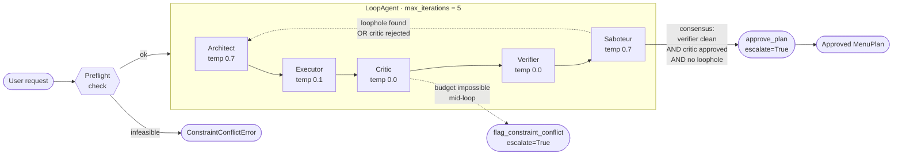

# AGEP v2 — Autonomous Gourmet Event Planner with Adversarial Consensus

A **five-agent** Plan-Act-Reflect-RedTeam system on [Google Agent Development
Kit][adk] that plans a dinner event end-to-end. v2 extends v1 with a
**Saboteur** — a red-team adversary that runs after the Verifier and
specifically hunts for loopholes the deterministic safety audit cannot see
(cross-contamination risk, restrictions outside the tool's categories,
hidden animal products). The plan is only approved when **both** the
rule-based Verifier and the LLM-based Saboteur clear it — *consensus safety*.

The default backend is **Claude Code headless** — no API key needed to run
locally. Swap to Gemini or Anthropic with a single env var.

> **Relationship to v1.** Everything from v1 still works — same Architect,
> Executor, and Critic, same `audit_menu_plan` tool, same three scenarios.
> The only structural change is that `approve_plan` has moved from the
> Verifier to the new Saboteur, so the loop now requires two independent
> safety votes instead of one. The original `main` branch, now renamed
> [`v1`](https://github.com/IrfanThomson/agep/tree/v1), is preserved for
> comparison.

[adk]: https://google.github.io/adk-docs/

---

## Architecture



**The five agents:**

| Agent         | Temp | Tools                              | What it does                                                                          |
|---------------|:----:|------------------------------------|---------------------------------------------------------------------------------------|
| **Architect** | 0.7  | *(none)*                           | Decomposes user intent into a JSON menu plan. Creative; may need corrections.         |
| **Executor**  | 0.1  | `price_menu_plan`                  | Batch-prices every ingredient against a simulated grocery API.                        |
| **Critic**    | 0.0  | `flag_constraint_conflict`         | Validates budget + macros. Emits concrete delta-instructions on rejection.            |
| **Verifier**  | 0.0  | `audit_menu_plan`                  | Deterministic ingredient audit against the tool's known restriction categories.       |
| **Saboteur**  | 0.7  | `approve_plan`                     | Red-team adversary; hunts loopholes the Verifier's tool can't see. Gates approval.    |

**Shared state** flows through `session.state`. Each agent declares an
`output_key`; the next agent reads it via `{placeholder}` substitution in its
instruction. No direct agent-to-agent coupling.

**Three self-correction sub-loops:**

- **Budget Correction** — if the Critic rejects, it writes `delta_instructions`
  to state. The Architect reads them next iteration and re-plans.
- **Hallucination Prevention** — the Verifier's `audit_menu_plan` checks every
  ingredient against the user's dietary restrictions. Any unsafe ingredient
  forces a re-plan.
- **Adversarial Consensus** *(new in v2)* — the Saboteur reads the Verifier's
  verdict and tries to attack it. If it finds a credible loophole the tool
  missed, it writes a `SaboteurReport` to state; the Architect applies the
  `proposed_fix` on the next iteration.

**Three termination paths:**

1. **Normal success** — Saboteur calls `approve_plan`, which sets
   `escalate=True` and breaks the `LoopAgent`. Requires the Critic approved,
   the Verifier's audit is clean, AND the Saboteur found no loophole.
2. **Infeasible request** — either the preflight check raises
   `ConstraintConflictError` before any LLM call (cheap), or the Critic calls
   `flag_constraint_conflict` mid-loop.
3. **Iteration budget exhausted** — `main.py` raises `RuntimeError` after 5
   unsuccessful iterations.

---

## What v2 adds: Adversarial Consensus

v1's safety story had a single point of failure: the Verifier ran a
deterministic audit against a finite list of restriction categories
(`_RESTRICTION_BLOCKS` in `tools.py`). Anything outside that list — hidden
gluten in commercially processed oats, sesame in tahini, honey in a "vegan"
dish, animal-based fining agents in a dijon vinaigrette — slipped through.
Worse, the Verifier's own approve call was the only gate, so the same
single source of truth both audited and greenlit the plan.

v2 splits those two responsibilities:

- The **Verifier** keeps doing exactly what it did in v1: call
  `audit_menu_plan`, mirror the result into state. It has NO authority to
  approve anymore. Its job is strictly deterministic audit within the tool's
  known categories.
- The new **Saboteur** reads the Verifier's verdict and tries to break it.
  Its prompt lists the gaps the tool cannot see:
  1. Cross-contamination during commercial processing (rolled oats on wheat
     lines; soy sauce containing wheat; malt vinegar from barley).
  2. Hidden allergens outside the tool's known categories (sesame in tahini;
     mustard in dressings; sulfites in dried fruit).
  3. Animal-derived ingredients that slip past naive vegan checks (honey;
     isinglass fining in wine; anchovies in Worcestershire).
  4. Implicit mitigations already noted by the Architect — if the plan
     already addresses a risk in its `notes` field, the Saboteur accepts it.

Consensus means both must clear: *rule-based* safety (fast, deterministic,
limited coverage) AND *LLM-based* safety (slower, probabilistic, broader
coverage). Either one alone has a well-known failure mode; together they're
defense in depth.

The concept is **Multi-Agent Debate** — two independent auditors with
different priors, both voting, and agreement required for the high-stakes
decision. Scenarios 1 and 4 below both exercise this loop directly.

---

## Live demo

The four scenarios below are built in. All logs are actual output captured
against the Claude Code backend with the default `sonnet` model.

### Scenario 1 — Happy path (Saboteur catches wine-fined dijon)

> 6 guests · $200 · Salmon + Quinoa required · vegan + nut-allergy

Demonstrates: Iterative Loop; Saboteur catching a non-obvious loophole the
Verifier's tool cannot see (vegan contamination via wine-fined dijon mustard).

```
$ python main.py --scenario happy

━━━━━━━━━━━━━━━━━━━━━━━━━━━━━━━━━━━━━━━━━━━━━━━━━━━━━━━━━━━━
 AGEP · scenario 'happy' · backend claude-code
 6 guests · $200 budget · required: Salmon, Quinoa · restrictions: vegan, nut-allergy
━━━━━━━━━━━━━━━━━━━━━━━━━━━━━━━━━━━━━━━━━━━━━━━━━━━━━━━━━━━━

Iteration 1
  architect  → drafted 4 recipes
  executor   → price_menu_plan(4 recipes, 39 ingredients)
  executor   ← $90.65 total · 0 unknown ingredients
  executor   → returned priced plan ($90.65)
  critic     → APPROVED · "Total cost of $90.65 is well within the $200 budget, all required ingredients (salmon, qu…"
  verifier   → audit_menu_plan(39 ingredients, [vegan, nut-allergy])
  verifier   ← APPROVED · 39 ingredients checked · 0 violations
  verifier   → APPROVED · 0 violations
  saboteur   → LOOPHOLE · "Dijon mustard in Dish 4 (the vegan salad vinaigrette) traditionally contains white wine, …"

Iteration 2
  architect  → drafted 4 recipes
  executor   → price_menu_plan(4 recipes, 39 ingredients)
  executor   ← $91.85 total · 0 unknown ingredients
  executor   → returned priced plan ($91.85)
  critic     → APPROVED · "Total cost of $91.85 is well within the $200 budget, all required ingredients (salmon, qu…"
  verifier   → audit_menu_plan(39 ingredients, [vegan, nut-allergy])
  verifier   ← APPROVED · 39 ingredients checked · 0 violations
  verifier   → APPROVED · 0 violations
  saboteur   → approve_plan — loop exits
  saboteur   ← approved=True
  saboteur   → CLEAR · "Audited all 39 ingredients across four dishes against the full threat model (cross-contam…"

────────────────────────────────────────────────────────────
 Plan approved in 2 iterations · $91.85
────────────────────────────────────────────────────────────

MENU

• Pan-Seared Salmon with Lemon-Dill-Caper Sauce (serves 6 · accommodates: nut-free)
    - 3.0 lb salmon               $36.00
    - 4.0 tbsp olive oil            $2.00
    - 3.0 count lemon                $2.25
    - 4.0 clove garlic               $1.00
    - 1.0 bunch dill                 $1.80
    - 2.0 tbsp capers               $0.80
    - 1.0 tbsp dijon mustard        $0.30
    - 2.0 tsp sea salt             $0.10
    - 1.0 tsp black pepper         $0.15

• Herbed Quinoa Pilaf with Roasted Vegetables (serves 6 · accommodates: vegan, nut-free)
    - 2.0 lb quinoa               $8.00
    - 4.0 cup vegetable broth      $0.80
    - 3.0 tbsp olive oil            $1.50
    - 1.0 count onion                $0.75
    - 3.0 clove garlic               $0.75
    - 2.0 count bell pepper          $3.00
    - 0.5 lb cherry tomatoes      $1.75
    - 1.0 bunch parsley              $1.50
    - 1.0 count lemon                $0.75
    - 1.0 tsp cumin                $0.20
    - 1.0 tsp smoked paprika       $0.25
    - 2.0 tsp sea salt             $0.10
    - 1.0 tsp black pepper         $0.15

• Roasted Asparagus with Garlic and Lemon (serves 6 · accommodates: vegan, nut-free)
    - 2.0 lb asparagus            $8.00
    - 2.0 tbsp olive oil            $1.00
    - 3.0 clove garlic               $0.75
    - 1.0 count lemon                $0.75
    - 1.0 tsp sea salt             $0.05
    - 1.0 tsp black pepper         $0.15

• Avocado and Mixed Greens Salad with Lemon-Herb Vinaigrette (serves 6 · accommodates: vegan, nut-free)
    - 0.5 lb mixed greens         $2.00
    - 3.0 count avocado              $5.25
    - 2.0 count cucumber             $2.00
    - 0.5 lb cherry tomatoes      $1.75
    - 1.0 bunch radish               $2.00
    - 3.0 tbsp olive oil            $1.50
    - 2.0 tbsp vinegar              $0.30
    - 1.0 count lemon                $0.75
    - 1.0 bunch parsley              $1.50
    - 1.0 tsp sea salt             $0.05
    - 1.0 tsp black pepper         $0.15
```

**What to notice:**
- **Iteration 1**: Critic approves (budget fine). Verifier's deterministic
  audit also approves — `dijon mustard` is tagged `is_vegan=True` in the
  nutrition database, so it passes the vegan check. **The Saboteur catches
  it anyway**: Dijon mustard's white-wine content is often fined with
  isinglass (fish bladder) or casein (dairy), making the mustard itself
  arguably non-vegan even though the product is nominally plant-based.
- **Iteration 2**: Architect reads `saboteur_report` from state, moves the
  dijon out of the vegan-tagged salad and into the salmon dish (already
  non-vegan). The per-guest vegan preference is satisfied by three other
  dishes that contain no dijon at all. Saboteur runs the same threat model
  on the revised plan, finds no unaddressed risk, calls `approve_plan`.
- This is **exactly the class of loophole the v1 Verifier would have missed**
  — the tool knows dijon's primary ingredients but not its typical
  processing, so it's silent on the wine-fining vector. The Saboteur exists
  specifically to cover that gap.

---

### Scenario 2 — Budget Correction Loop

> Same as happy, but **$60 budget** — forces the Critic to reject and re-plan.

Demonstrates: Correction Loop with explicit delta-instructions; Saboteur
deferring to the Critic on budget rejections.

```
$ python main.py --scenario budget_crunch

━━━━━━━━━━━━━━━━━━━━━━━━━━━━━━━━━━━━━━━━━━━━━━━━━━━━━━━━━━━━
 AGEP · scenario 'budget_crunch' · backend claude-code
 6 guests · $60 budget · required: Salmon, Quinoa · restrictions: vegan, nut-allergy
━━━━━━━━━━━━━━━━━━━━━━━━━━━━━━━━━━━━━━━━━━━━━━━━━━━━━━━━━━━━

Iteration 1
  architect  → drafted 3 recipes
  executor   → price_menu_plan(3 recipes, 23 ingredients)
  executor   ← $63.80 total · 0 unknown ingredients
  executor   → returned priced plan ($63.80)
  critic     → REJECTED · "Total cost of $63.80 exceeds the $60.00 budget by $3.80." · 1 delta-instruction
  verifier   → audit_menu_plan(23 ingredients, [vegan, nut-allergy])
  verifier   ← APPROVED · 23 ingredients checked · 0 violations
  verifier   → APPROVED · 0 violations
  saboteur   → LOOPHOLE · "plan exceeds budget; Critic rejected"

Iteration 2
  architect  → drafted 3 recipes
  executor   → price_menu_plan(3 recipes, 23 ingredients)
  executor   ← $57.80 total · 0 unknown ingredients
  executor   → returned priced plan ($57.80)
  critic     → APPROVED · "Total cost of $57.80 is within the $60.00 budget, all dishes are nut-free, both required …"
  verifier   → audit_menu_plan(23 ingredients, [vegan, nut-allergy])
  verifier   ← APPROVED · 23 ingredients checked · 0 violations
  verifier   → APPROVED · 0 violations
  saboteur   → approve_plan — loop exits
  saboteur   ← approved=True
  saboteur   → CLEAR · "Audited all 23 ingredients against the full threat model: no hidden allergens (no tahini,…"

────────────────────────────────────────────────────────────
 Plan approved in 2 iterations · $57.80
────────────────────────────────────────────────────────────

MENU

• Herbed Quinoa Tabbouleh (serves 6 · accommodates: vegan, nut-free)
    - 1.5 lb quinoa               $6.00
    - 0.5 lb cherry tomatoes      $1.75
    - 2.0 count cucumber             $2.00
    - 1.0 bunch parsley              $1.50
    - 3.0 tbsp olive oil            $1.50
    - 2.0 count lemon                $1.50
    - 2.0 tsp sea salt             $0.10
    - 1.0 tsp black pepper         $0.15

• Lemon-Dill Baked Salmon (serves 6 · accommodates: nut-free)
    - 2.0 lb salmon               $24.00
    - 2.0 count lemon                $1.50
    - 1.0 bunch dill                 $1.80
    - 3.0 tbsp olive oil            $1.50
    - 4.0 clove garlic               $1.00
    - 2.0 tbsp capers               $0.80
    - 2.0 tsp sea salt             $0.10
    - 1.0 tsp black pepper         $0.15

• Garlic-Roasted Asparagus with Cherry Tomatoes (serves 6 · accommodates: vegan, nut-free)
    - 2.0 lb asparagus            $8.00
    - 0.5 lb cherry tomatoes      $1.75
    - 3.0 clove garlic               $0.75
    - 2.0 tbsp olive oil            $1.00
    - 1.0 count lemon                $0.75
    - 1.0 tsp sea salt             $0.05
    - 1.0 tsp black pepper         $0.15
```

**What to notice:**
- Iteration 1 total: **$63.80** → Critic rejects with a delta-instruction.
  Notably, the Saboteur *also* refuses to approve, citing
  `plan exceeds budget; Critic rejected`. This is by design: the
  Saboteur's prompt explicitly checks `critique.status` first, so the
  red-teamer won't rubber-stamp a plan the budget auditor has already
  rejected. Both safety agents agree it's not ready.
- Iteration 2: total drops to **$57.80** (salmon reduced from 2.5 lb to
  2.0 lb per the delta-instruction), all three agents clear, Saboteur
  calls `approve_plan`.
- The Saboteur running on a clean menu is cheap — the prompt is scoped so
  the red-teamer doesn't invent theoretical risks on a pared-down plan.

---

### Scenario 3 — Human Escalation (preflight)

> 20 guests · $10 budget — mathematically infeasible before any agent runs.

Demonstrates: `ConstraintConflictError` short-circuiting the loop.

```
$ python main.py --scenario impossible

━━━━━━━━━━━━━━━━━━━━━━━━━━━━━━━━━━━━━━━━━━━━━━━━━━━━━━━━━━━━
 AGEP · scenario 'impossible' · backend claude-code
 20 guests · $10 budget · required: — · restrictions: —
━━━━━━━━━━━━━━━━━━━━━━━━━━━━━━━━━━━━━━━━━━━━━━━━━━━━━━━━━━━━

❌ ConstraintConflictError: Budget of $10.00 for 20 guests = $0.50/guest, below the floor of $8.00/guest. Constraints are mathematically infeasible.
```

**What to notice:**
- Zero LLM calls. Zero tokens spent. The preflight catches the impossibility
  before the `LoopAgent` is even constructed. The Critic has a mirror tool
  (`flag_constraint_conflict`) for cases that only become
  obviously-impossible mid-loop. The Saboteur never runs on this path — it
  only fires if the five-agent loop is entered.

---

### Scenario 4 — Hidden Gluten *(the v2 headline demo)*

> 6 guests · $150 · **rolled oats** required · **gluten-free**

Demonstrates: Adversarial Consensus catching a real-world cross-contamination
risk (rolled oats and vegetable broth commonly contain gluten even though
the nutrition database tags them `allergens=[]`).

```
$ python main.py --scenario hidden_gluten

━━━━━━━━━━━━━━━━━━━━━━━━━━━━━━━━━━━━━━━━━━━━━━━━━━━━━━━━━━━━
 AGEP · scenario 'hidden_gluten' · backend claude-code
 6 guests · $150 budget · required: rolled oats · restrictions: gluten-free
━━━━━━━━━━━━━━━━━━━━━━━━━━━━━━━━━━━━━━━━━━━━━━━━━━━━━━━━━━━━

Iteration 1
  architect  → drafted 4 recipes
  executor   → price_menu_plan(4 recipes, 42 ingredients)
  executor   ← $112.85 total · 0 unknown ingredients
  executor   → returned priced plan ($112.85)
  critic     → APPROVED · "Total cost of $112.85 is within the $150.00 budget, all four courses accommodate gluten-f…"
  verifier   → audit_menu_plan(42 ingredients, [gluten-free])
  verifier   ← APPROVED · 42 ingredients checked · 0 violations
  verifier   → APPROVED · 0 violations
  saboteur   → LOOPHOLE · "Commercial vegetable broth — used in two recipes totalling 7 cups — is not inherently glu…"

Iteration 2
  architect  → drafted 4 recipes
  executor   → price_menu_plan(4 recipes, 42 ingredients)
  executor   ← $112.85 total · 0 unknown ingredients
  executor   → returned priced plan ($112.85)
  critic     → APPROVED · "Total cost of $112.85 is within the $150.00 budget, all courses accommodate gluten-free r…"
  verifier   → audit_menu_plan(42 ingredients, [gluten-free])
  verifier   ← APPROVED · 42 ingredients checked · 0 violations
  verifier   → APPROVED · 0 violations
  saboteur   → approve_plan — loop exits
  saboteur   ← approved=True
  saboteur   → CLEAR · no loophole found

────────────────────────────────────────────────────────────
 Plan approved in 2 iterations · $112.85
────────────────────────────────────────────────────────────

SOURCING CAVEAT — Rolled Oats: Oats are naturally gluten-free but are very frequently cross-contaminated with wheat at the farm or mill level. To keep this menu safe for all guests under the gluten-free restriction, ONLY certified gluten-free rolled oats must be purchased (look for GFCO certification or equivalent). This caveat applies to the Honey Almond Oat Bars. | SOURCING CAVEAT — Vegetable Broth: must be explicitly labelled gluten-free (e.g. Pacific Foods GF Vegetable Broth, Swanson Certified GF, or unseasoned homemade stock). Many mainstream brands and all bouillon cubes should be assumed to contain wheat unless the label states otherwise.

MENU

• Creamy Coconut Lentil Soup (serves 6 · accommodates: gluten-free, vegan, vegetarian, dairy-free)
    - 1.5 lb lentils              $3.75
    - 2.0 can coconut milk         $7.00
    - 4.0 cup vegetable broth      $0.80
    - 2.0 count onion                $1.50
    - 4.0 clove garlic               $1.00
    - 2.0 tbsp ginger               $0.50
    - 2.0 tsp turmeric             $0.40
    - 2.0 tsp cumin                $0.40
    - 1.0 lb carrot               $1.20
    - 2.0 tbsp tomato paste         $1.00
    - 2.0 tbsp olive oil            $1.00
    - 2.0 tsp sea salt             $0.10
    - 1.0 tsp black pepper         $0.15
    - 1.0 bunch cilantro             $1.50
    - 2.0 count lime                 $1.00

• Pan-Seared Salmon with Herb Quinoa (serves 6 · accommodates: gluten-free, dairy-free)
    - 3.0 lb salmon               $36.00
    - 1.5 lb quinoa               $6.00
    - 3.0 cup vegetable broth      $0.60
    - 4.0 clove garlic               $1.00
    - 2.0 count lemon                $1.50
    - 1.0 bunch dill                 $1.80
    - 1.0 bunch parsley              $1.50
    - 3.0 tbsp olive oil            $1.50
    - 2.0 tbsp capers               $0.80
    - 1.0 tsp sea salt             $0.05
    - 1.0 tsp black pepper         $0.15

• Roasted Asparagus and Cherry Tomato Salad with Pine Nuts (serves 6 · accommodates: gluten-free, vegan, vegetarian, dairy-free)
    - 2.0 lb asparagus            $8.00
    - 1.0 lb cherry tomatoes      $3.50
    - 0.5 lb arugula              $2.00
    - 0.25 lb pine nuts            $5.50
    - 3.0 tbsp olive oil            $1.50
    - 1.0 count lemon                $0.75
    - 2.0 clove garlic               $0.50
    - 1.0 tsp sea salt             $0.05
    - 0.5 tsp black pepper         $0.07

• Honey Almond Oat Bars (serves 6 · accommodates: gluten-free, vegetarian)
    - 1.5 lb rolled oats          $2.25
    - 0.5 lb almond flour         $6.00
    - 0.5 lb almonds              $5.50
    - 4.0 tbsp honey                $1.60
    - 2.0 tbsp maple syrup          $1.60
    - 3.0 tbsp coconut oil          $1.80
    - 0.5 tsp sea salt             $0.03
```

**What to notice:**
- **The Verifier's audit approved on both iterations.** That's not a bug —
  the tool faithfully reported what it knew: neither `rolled oats` nor
  `vegetable broth` has a `gluten` tag in `_NUTRITION_DB`, so the
  deterministic audit has no basis to flag them. A celiac guest following
  only the v1 pipeline would have been served gluten.
- **Iteration 1 Saboteur catches the vegetable broth**: *"Commercial
  vegetable broth is not inherently gluten-free — most mainstream brands
  and all bouillon cubes contain wheat-derived ingredients unless
  explicitly labelled GF."* The report is written to
  `session.state.saboteur_report`.
- **Iteration 2 Architect reads `saboteur_report` and applies the fix** —
  but does more than asked. Rather than replacing the broth, it adds
  explicit sourcing caveats for BOTH the broth AND the rolled oats (oats
  face the same cross-contamination risk, which the Architect correctly
  generalized from the broth example). The caveats appear in the plan's
  `notes` field — a human-facing sourcing instruction that would appear on
  the grocery list. Saboteur verifies the mitigations are now documented,
  calls `approve_plan`, loop exits.
- **This is exactly the v2 thesis**: the deterministic audit is necessary
  but insufficient; the LLM-based adversary covers the gaps. Either one
  alone ships a broken menu; together they ship a safe one.

---

## Quickstart

### Default — Claude Code (no API key)

```bash
git clone https://github.com/IrfanThomson/agep.git
cd agep
python -m venv .venv && source .venv/bin/activate
pip install -r requirements.txt
python main.py --scenario hidden_gluten
```

The `claude-agent-sdk` package ships a bundled Claude Code CLI and reuses
your local auth. No key configuration required.

### Anthropic API key

```bash
pip install "google-adk[extensions]"     # adds LiteLLM support
export ANTHROPIC_API_KEY=sk-ant-...
python main.py --scenario hidden_gluten --backend anthropic
```

### Google Gemini API key

```bash
export GOOGLE_API_KEY=...
python main.py --scenario hidden_gluten --backend gemini
```

### CLI reference

```
usage: agep [-h] [--scenario {budget_crunch,happy,hidden_gluten,impossible}]
            [--backend {claude-code,anthropic,gemini}]
            [--model MODEL] [--verbose]
```

| Flag         | Default       | Purpose                                                          |
|--------------|---------------|------------------------------------------------------------------|
| `--scenario` | `happy`       | Built-in scenario selector.                                      |
| `--backend`  | `claude-code` | Overrides `AGEP_LLM`.                                            |
| `--model`    | backend-specific | Overrides `AGEP_MODEL`. `sonnet`, `opus`, `gemini-2.5-pro`, … |
| `--verbose`  | off           | DEBUG logs from ADK and the adapter.                             |

Set `AGEP_DEBUG=1` to stream the Claude Code subprocess stderr to your
terminal — useful when debugging the adapter itself.

---

## Code map

```
agep/
├── README.md          # You are here
├── requirements.txt
├── .env.example       # Backend selector + optional API keys
├── state.py           # Pydantic models: EventConstraints, MenuPlan, Critique, SafetyAudit, SaboteurReport
├── tools.py           # Simulated grocery/nutrition DBs + escalation hooks
├── llm.py             # Pluggable backend selector + ClaudeCodeLlm BaseLlm adapter
├── agents.py          # 5 LlmAgents + the LoopAgent(max_iterations=5)
└── main.py            # CLI + preflight + Runner + human-readable event formatter
```

Five files, ~1950 lines, no magic. Each file's top-of-module docstring
explains its scope.

---

## How the Claude Code backend works

Google ADK is Gemini-first, but it exposes a clean abstract base class called
`BaseLlm` you can subclass to bring any model backend. `llm.py::ClaudeCodeLlm`
implements that interface on top of the `claude-agent-sdk` Python package,
routing each ADK `LlmRequest` into a Claude Code subprocess.

Three details worth highlighting:

1. **Prompt-level tool orchestration.** Claude Code doesn't speak ADK's
   native tool-use protocol, so the adapter serializes tool schemas into the
   system prompt and asks Claude to respond with a JSON envelope:
   `{"action": "tool_call", "tool_name": "...", "arguments": {...}}` or
   `{"action": "text", "content": "..."}`. The adapter parses that back into
   the `Content`/`Part` structure ADK expects. Less robust than native
   function-calling, but it's what buys the no-API-key story.

2. **Tools are framed as "functions", never as "tools".** If the system
   prompt mentions "tools", Claude Code attempts real tool execution and the
   subprocess crashes. The adapter carefully describes them as *"external
   functions to request via JSON"*.

3. **Temperature is a soft hint.** The CLI does not expose a temperature
   flag, so the adapter prepends a style directive to the system prompt
   (`0.0 → "Be strictly deterministic"`, `0.7 → "Be creative"`). For precise
   temperature control, route through the `anthropic` (LiteLLM) or `gemini`
   backend.

---

## Extending

**Swap in a real grocery API** — replace `price_menu_plan` in `tools.py` with
a call to Kroger / Instacart / USDA. Agent code doesn't change; that's the
point of the tool abstraction.

**Add dietary restrictions** — edit `_RESTRICTION_BLOCKS`,
`_GLOBAL_EXCLUSIONS`, and `_PER_GUEST_PREFERENCES` in `tools.py`. The
Saboteur will often catch gaps in these lists before you even notice them.

**Add threat categories to the Saboteur** — edit the `Threat model` block in
`SABOTEUR_PROMPT` (`agents.py`). Adding a new category (e.g. "bioaccumulated
mercury in large predatory fish") gives the Saboteur a new dimension to
audit without changing any other agent's code.

**Persist sessions** — swap `InMemoryRunner` for a persistent `SessionService`
(e.g. `VertexAiSessionService`).

**Add pytest** — the four scenarios are dispatch-ready for pytest; assert on
`plan_approved=True`, `total_cost_usd <= budget`, and that
`ConstraintConflictError` fires for `impossible`. For `hidden_gluten`,
assert the final plan's `notes` contains a certified-GF sourcing caveat.

---

## Requirements

- Python 3.10+
- One of:
  - Claude Code installed and authenticated locally (default), OR
  - `ANTHROPIC_API_KEY` + `google-adk[extensions]`, OR
  - `GOOGLE_API_KEY`
