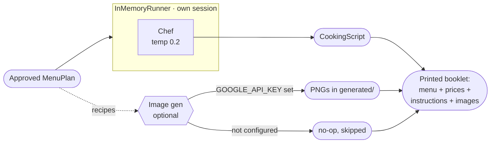

# AGEP v3 — Autonomous Gourmet Event Planner with Cookable Output

A **six-agent** Plan-Act-Reflect-RedTeam-then-Cook system on [Google Agent
Development Kit][adk] that turns a dinner-party request into a printable
booklet: a priced menu, step-by-step cooking instructions, and (optionally)
AI-generated dish photography. v3 takes the v2 safety pipeline — Architect,
Executor, Critic, Verifier, Saboteur — and bolts on a post-loop **Chef**
stage plus operational constraints (kitchen equipment, prep-time ceiling,
calorie / protein floors), so the approved plan is something you can actually
walk into the kitchen and execute.

The default backend is **Claude Code headless** — no API key needed to run
locally. The default grocery backend is the same in-process simulator from
v1/v2, with **Spoonacular** available as a one-env-var swap. Dish image
generation is opt-in and falls back silently when not configured.

> **Relationship to v2.** v3 is strictly additive on the safety side.
> Same five-agent loop, same `LoopAgent(max_iterations=5)`, same
> `approve_plan` gate, same Adversarial Consensus rule. The Critic gained
> three new validation tools (equipment, prep time, macros), the Architect's
> prompt knows how to respect them, and a sixth agent (Chef) now runs in
> its **own runner** after the loop terminates. v1 and v2 are preserved as
> the [`v1`](https://github.com/IrfanThomson/agep/tree/v1) and
> [`v2`](https://github.com/IrfanThomson/agep/tree/v2) branches for direct
> comparison.

[adk]: https://google.github.io/adk-docs/

---

## Architecture


After the loop terminates with an approved plan, control passes to a second,
independent runner:



**The six agents:**

| Agent         | Temp | Stage     | Tools                                                            | What it does                                                                          |
|---------------|:----:|-----------|------------------------------------------------------------------|---------------------------------------------------------------------------------------|
| **Architect** | 0.7  | in-loop   | *(none)*                                                         | Decomposes user intent into a JSON menu plan with `prep_minutes` + `required_equipment` per recipe. |
| **Executor**  | 0.1  | in-loop   | `price_menu_plan`                                                | Batch-prices every ingredient. Backend is simulated by default, Spoonacular if `AGEP_GROCERY=spoonacular`. |
| **Critic**    | 0.0  | in-loop   | `validate_nutrition_macros`, `check_equipment`, `validate_prep_time`, `flag_constraint_conflict` | Validates budget + macros + equipment + prep time. Emits concrete delta-instructions on rejection. |
| **Verifier**  | 0.0  | in-loop   | `audit_menu_plan`                                                | Deterministic ingredient audit against the tool's known restriction categories.       |
| **Saboteur**  | 0.7  | in-loop   | `approve_plan`                                                   | Red-team adversary; hunts loopholes the Verifier's tool can't see. Gates approval.    |
| **Chef**      | 0.2  | post-loop | *(none)*                                                         | Writes step-by-step cooking instructions for the approved menu, in its own runner.    |

**Shared state** flows through `session.state`. Each agent declares an
`output_key`; the next agent reads it via `{placeholder}` substitution in its
instruction. The Chef runs against a fresh session whose only seed is the
approved `grounded_plan` — there is no path by which Chef output can mutate
loop state.

**Three self-correction sub-loops:**

- **Budget / Operational Correction** — if the Critic rejects (over budget,
  missing equipment, prep over ceiling, macros below floor), it writes
  `delta_instructions` to state. The Architect reads them next iteration and
  re-plans.
- **Hallucination Prevention** — the Verifier's `audit_menu_plan` checks
  every ingredient against the user's dietary restrictions. Any unsafe
  ingredient forces a re-plan.
- **Adversarial Consensus** — the Saboteur reads the Verifier's verdict and
  tries to attack it. If it finds a credible loophole the tool missed, it
  writes a `SaboteurReport` to state; the Architect applies the
  `proposed_fix` on the next iteration.

**Three termination paths:**

1. **Normal success** — Saboteur calls `approve_plan`, which sets
   `escalate=True` and breaks the `LoopAgent`. Requires the Critic approved,
   the Verifier's audit is clean, AND the Saboteur found no loophole. Once
   the loop exits, `main.py` runs the Chef and (if configured) image gen.
2. **Infeasible request** — either the preflight check raises
   `ConstraintConflictError` before any LLM call (cheap), or the Critic calls
   `flag_constraint_conflict` mid-loop. Chef does not run on this path.
3. **Iteration budget exhausted** — `main.py` raises `RuntimeError` after 5
   unsuccessful iterations. Chef does not run on this path either.

---

## What v3 adds

v2 shipped a safe menu. v3 ships a *cookable* menu. Four pieces, in order
of how they wire into the loop:

### 1. Operational constraints (equipment, prep time, macros)

The Critic is no longer just a budget watchdog. Three new tools turn it into
a full operational gate:

- **`check_equipment(plan_json, available_equipment)`** — every recipe in
  the plan declares a `required_equipment` list. The tool computes
  `set(required) - set(available)` per recipe and rejects if anything is
  missing. Catches the failure mode where the Architect happily writes
  "blend until smooth" for a guest who explicitly said they only have a
  stovetop and a sheet pan.
- **`validate_prep_time(plan_json, max_prep_minutes)`** — sums each recipe's
  `prep_minutes` and rejects if the total exceeds the user's wall-clock
  ceiling. Single-cook assumption, no parallelism credit. Catches the
  failure mode where every individual dish looks fast but the four-course
  sum is three hours.
- **`validate_nutrition_macros(plan_json, guests, calorie_floor_per_guest, protein_floor_per_guest_g)`** —
  aggregates calories and protein across all recipes, divides by guest
  count, and rejects if either floor is unmet. Catches the failure mode
  where a "healthy" salad-heavy menu would leave four hungry adults under
  500 kcal and 25 g protein each.

Each tool returns a structured pass/fail with concrete delta hints. The
Critic prompt runs them in fixed order (budget → macros → equipment → prep
time), aggregates every violation into one `Critique`, and emits one
delta-instruction list. The Architect re-plans with the deltas in hand.

These constraints are all **opt-in via the EventConstraints model**. Leave
`kitchen_equipment` empty and `max_prep_minutes` / the macro floors `None`,
and the Critic skips those tools entirely — v2 behaviour is preserved
exactly.

### 2. Cooking instructions (Chef agent, outside the loop)

After the safety loop approves, `main.py` constructs a brand-new
`InMemoryRunner` for a single agent — the Chef — with a fresh session
containing only the approved `grounded_plan`. The Chef writes a
`CookingScript`: per-recipe atomic imperative steps with temperatures,
timing, and ingredient quantities pulled from the plan.

The Chef runs in its own runner **on purpose**. The deliberate property:
no Chef output — malformed JSON, missing recipes, hallucinated steps,
nothing — can retroactively invalidate or modify a menu the safety loop
already approved. The booklet either gets cooking instructions, or it
doesn't (and prints the menu without them); it cannot become unsafe because
the Chef misbehaved. If the Chef call raises, `main.py` catches the
exception, prints `chef → ERROR · …`, and renders the menu without steps.

`--no-chef` skips the stage entirely.

### 3. Real grocery pricing (Spoonacular adapter, optional)

The Executor's tool, `price_menu_plan`, is now a dispatcher:

- `AGEP_GROCERY=simulated` *(default)* routes to the bundled in-process
  database from v1/v2. Zero dependencies, deterministic, free.
- `AGEP_GROCERY=spoonacular` routes to `tools_spoonacular.py`, which calls
  the Spoonacular Food API over HTTPS. Requires `SPOONACULAR_API_KEY` and
  the `requests` package. The free tier is 150 requests/day.

Both backends honour the same return contract — `grounded_plan`,
`unknown_ingredients`, `source` — so no agent prompt changes when you flip
the env var. The Spoonacular adapter caches name→ID lookups and per-line
price results in process, so a session with repeated ingredients (olive oil
appearing in four recipes) costs one search and one price call rather than
eight. Failures on a single ingredient mark it `unknown` and let the loop
continue, mirroring the simulated backend's tolerance.

### 4. Dish images (Gemini image gen, optional)

When `GOOGLE_API_KEY` is set and `google-genai` is installed,
`images.generate_dish_images` runs once after the Chef stage, asks Gemini
(default `gemini-2.5-flash-image-preview`, override with
`AGEP_IMAGE_MODEL`) for one PNG per recipe, and writes them to
`generated/<scenario>/`. The booklet then prints `Image: <path>` next to
each dish.

If the key is missing or the package isn't installed, the function returns
`{"status": "skipped", "reason": "..."}` and AGEP prints the booklet
without images. There is no crash path — image gen is a pure garnish.

`--no-images` skips the stage even when configured.

---

## Live demo

The six built-in scenarios below exercise the full v3 surface. The first
four are unchanged from v2 and their captured logs are preserved verbatim;
the last two are new and exercise the v3 Critic tools.

### Scenario 1 — Happy path (Saboteur catches wine-fined dijon)

> 6 guests · $200 · Salmon + Quinoa required · vegan + nut-allergy

Demonstrates: Iterative Loop; Saboteur catching a non-obvious loophole the
Verifier's tool cannot see (vegan contamination via wine-fined dijon mustard).

```
$ python main.py --scenario happy

━━━━━━━━━━━━━━━━━━━━━━━━━━━━━━━━━━━━━━━━━━━━━━━━━━━━━━━━━━━━
 AGEP · scenario 'happy' · backend claude-code
 6 guests · $200 budget · required: Salmon, Quinoa · restrictions: vegan, nut-allergy
━━━━━━━━━━━━━━━━━━━━━━━━━━━━━━━━━━━━━━━━━━━━━━━━━━━━━━━━━━━━

Iteration 1
  architect  → drafted 4 recipes
  executor   → price_menu_plan(4 recipes, 39 ingredients)
  executor   ← $90.65 total · 0 unknown ingredients
  executor   → returned priced plan ($90.65)
  critic     → APPROVED · "Total cost of $90.65 is well within the $200 budget, all required ingredients (salmon, qu…"
  verifier   → audit_menu_plan(39 ingredients, [vegan, nut-allergy])
  verifier   ← APPROVED · 39 ingredients checked · 0 violations
  verifier   → APPROVED · 0 violations
  saboteur   → LOOPHOLE · "Dijon mustard in Dish 4 (the vegan salad vinaigrette) traditionally contains white wine, …"

Iteration 2
  architect  → drafted 4 recipes
  executor   → price_menu_plan(4 recipes, 39 ingredients)
  executor   ← $91.85 total · 0 unknown ingredients
  executor   → returned priced plan ($91.85)
  critic     → APPROVED · "Total cost of $91.85 is well within the $200 budget, all required ingredients (salmon, qu…"
  verifier   → audit_menu_plan(39 ingredients, [vegan, nut-allergy])
  verifier   ← APPROVED · 39 ingredients checked · 0 violations
  verifier   → APPROVED · 0 violations
  saboteur   → approve_plan — loop exits
  saboteur   ← approved=True
  saboteur   → CLEAR · "Audited all 39 ingredients across four dishes against the full threat model (cross-contam…"

────────────────────────────────────────────────────────────
 Plan approved in 2 iterations · $91.85
────────────────────────────────────────────────────────────

MENU

• Pan-Seared Salmon with Lemon-Dill-Caper Sauce (serves 6 · accommodates: nut-free)
    - 3.0 lb salmon               $36.00
    - 4.0 tbsp olive oil            $2.00
    - 3.0 count lemon                $2.25
    - 4.0 clove garlic               $1.00
    - 1.0 bunch dill                 $1.80
    - 2.0 tbsp capers               $0.80
    - 1.0 tbsp dijon mustard        $0.30
    - 2.0 tsp sea salt             $0.10
    - 1.0 tsp black pepper         $0.15

• Herbed Quinoa Pilaf with Roasted Vegetables (serves 6 · accommodates: vegan, nut-free)
    - 2.0 lb quinoa               $8.00
    - 4.0 cup vegetable broth      $0.80
    - 3.0 tbsp olive oil            $1.50
    - 1.0 count onion                $0.75
    - 3.0 clove garlic               $0.75
    - 2.0 count bell pepper          $3.00
    - 0.5 lb cherry tomatoes      $1.75
    - 1.0 bunch parsley              $1.50
    - 1.0 count lemon                $0.75
    - 1.0 tsp cumin                $0.20
    - 1.0 tsp smoked paprika       $0.25
    - 2.0 tsp sea salt             $0.10
    - 1.0 tsp black pepper         $0.15

• Roasted Asparagus with Garlic and Lemon (serves 6 · accommodates: vegan, nut-free)
    - 2.0 lb asparagus            $8.00
    - 2.0 tbsp olive oil            $1.00
    - 3.0 clove garlic               $0.75
    - 1.0 count lemon                $0.75
    - 1.0 tsp sea salt             $0.05
    - 1.0 tsp black pepper         $0.15

• Avocado and Mixed Greens Salad with Lemon-Herb Vinaigrette (serves 6 · accommodates: vegan, nut-free)
    - 0.5 lb mixed greens         $2.00
    - 3.0 count avocado              $5.25
    - 2.0 count cucumber             $2.00
    - 0.5 lb cherry tomatoes      $1.75
    - 1.0 bunch radish               $2.00
    - 3.0 tbsp olive oil            $1.50
    - 2.0 tbsp vinegar              $0.30
    - 1.0 count lemon                $0.75
    - 1.0 bunch parsley              $1.50
    - 1.0 tsp sea salt             $0.05
    - 1.0 tsp black pepper         $0.15
```

**What to notice:**
- **Iteration 1**: Critic approves (budget fine). Verifier's deterministic
  audit also approves — `dijon mustard` is tagged `is_vegan=True` in the
  nutrition database, so it passes the vegan check. **The Saboteur catches
  it anyway**: Dijon mustard's white-wine content is often fined with
  isinglass (fish bladder) or casein (dairy), making the mustard itself
  arguably non-vegan even though the product is nominally plant-based.
- **Iteration 2**: Architect reads `saboteur_report` from state, moves the
  dijon out of the vegan-tagged salad and into the salmon dish (already
  non-vegan). The per-guest vegan preference is satisfied by three other
  dishes that contain no dijon at all. Saboteur runs the same threat model
  on the revised plan, finds no unaddressed risk, calls `approve_plan`.
- This is **exactly the class of loophole the v1 Verifier would have missed**
  — the tool knows dijon's primary ingredients but not its typical
  processing, so it's silent on the wine-fining vector. The Saboteur exists
  specifically to cover that gap.

---

### Scenario 2 — Budget Correction Loop

> Same as happy, but **$60 budget** — forces the Critic to reject and re-plan.

Demonstrates: Correction Loop with explicit delta-instructions; Saboteur
deferring to the Critic on budget rejections.

```
$ python main.py --scenario budget_crunch

━━━━━━━━━━━━━━━━━━━━━━━━━━━━━━━━━━━━━━━━━━━━━━━━━━━━━━━━━━━━
 AGEP · scenario 'budget_crunch' · backend claude-code
 6 guests · $60 budget · required: Salmon, Quinoa · restrictions: vegan, nut-allergy
━━━━━━━━━━━━━━━━━━━━━━━━━━━━━━━━━━━━━━━━━━━━━━━━━━━━━━━━━━━━

Iteration 1
  architect  → drafted 3 recipes
  executor   → price_menu_plan(3 recipes, 23 ingredients)
  executor   ← $63.80 total · 0 unknown ingredients
  executor   → returned priced plan ($63.80)
  critic     → REJECTED · "Total cost of $63.80 exceeds the $60.00 budget by $3.80." · 1 delta-instruction
  verifier   → audit_menu_plan(23 ingredients, [vegan, nut-allergy])
  verifier   ← APPROVED · 23 ingredients checked · 0 violations
  verifier   → APPROVED · 0 violations
  saboteur   → LOOPHOLE · "plan exceeds budget; Critic rejected"

Iteration 2
  architect  → drafted 3 recipes
  executor   → price_menu_plan(3 recipes, 23 ingredients)
  executor   ← $57.80 total · 0 unknown ingredients
  executor   → returned priced plan ($57.80)
  critic     → APPROVED · "Total cost of $57.80 is within the $60.00 budget, all dishes are nut-free, both required …"
  verifier   → audit_menu_plan(23 ingredients, [vegan, nut-allergy])
  verifier   ← APPROVED · 23 ingredients checked · 0 violations
  verifier   → APPROVED · 0 violations
  saboteur   → approve_plan — loop exits
  saboteur   ← approved=True
  saboteur   → CLEAR · "Audited all 23 ingredients against the full threat model: no hidden allergens (no tahini,…"

────────────────────────────────────────────────────────────
 Plan approved in 2 iterations · $57.80
────────────────────────────────────────────────────────────

MENU

• Herbed Quinoa Tabbouleh (serves 6 · accommodates: vegan, nut-free)
    - 1.5 lb quinoa               $6.00
    - 0.5 lb cherry tomatoes      $1.75
    - 2.0 count cucumber             $2.00
    - 1.0 bunch parsley              $1.50
    - 3.0 tbsp olive oil            $1.50
    - 2.0 count lemon                $1.50
    - 2.0 tsp sea salt             $0.10
    - 1.0 tsp black pepper         $0.15

• Lemon-Dill Baked Salmon (serves 6 · accommodates: nut-free)
    - 2.0 lb salmon               $24.00
    - 2.0 count lemon                $1.50
    - 1.0 bunch dill                 $1.80
    - 3.0 tbsp olive oil            $1.50
    - 4.0 clove garlic               $1.00
    - 2.0 tbsp capers               $0.80
    - 2.0 tsp sea salt             $0.10
    - 1.0 tsp black pepper         $0.15

• Garlic-Roasted Asparagus with Cherry Tomatoes (serves 6 · accommodates: vegan, nut-free)
    - 2.0 lb asparagus            $8.00
    - 0.5 lb cherry tomatoes      $1.75
    - 3.0 clove garlic               $0.75
    - 2.0 tbsp olive oil            $1.00
    - 1.0 count lemon                $0.75
    - 1.0 tsp sea salt             $0.05
    - 1.0 tsp black pepper         $0.15
```

**What to notice:**
- Iteration 1 total: **$63.80** → Critic rejects with a delta-instruction.
  Notably, the Saboteur *also* refuses to approve, citing
  `plan exceeds budget; Critic rejected`. This is by design: the
  Saboteur's prompt explicitly checks `critique.status` first, so the
  red-teamer won't rubber-stamp a plan the budget auditor has already
  rejected. Both safety agents agree it's not ready.
- Iteration 2: total drops to **$57.80** (salmon reduced from 2.5 lb to
  2.0 lb per the delta-instruction), all three agents clear, Saboteur
  calls `approve_plan`.
- The Saboteur running on a clean menu is cheap — the prompt is scoped so
  the red-teamer doesn't invent theoretical risks on a pared-down plan.

---

### Scenario 3 — Human Escalation (preflight)

> 20 guests · $10 budget — mathematically infeasible before any agent runs.

Demonstrates: `ConstraintConflictError` short-circuiting the loop.

```
$ python main.py --scenario impossible

━━━━━━━━━━━━━━━━━━━━━━━━━━━━━━━━━━━━━━━━━━━━━━━━━━━━━━━━━━━━
 AGEP · scenario 'impossible' · backend claude-code
 20 guests · $10 budget · required: — · restrictions: —
━━━━━━━━━━━━━━━━━━━━━━━━━━━━━━━━━━━━━━━━━━━━━━━━━━━━━━━━━━━━

ConstraintConflictError: Budget of $10.00 for 20 guests = $0.50/guest, below the floor of $8.00/guest. Constraints are mathematically infeasible.
```

**What to notice:**
- Zero LLM calls. Zero tokens spent. The preflight catches the impossibility
  before the `LoopAgent` is even constructed. The Critic has a mirror tool
  (`flag_constraint_conflict`) for cases that only become
  obviously-impossible mid-loop. Neither the Saboteur nor the Chef ever
  runs on this path — both are gated behind a successful loop exit.

---

### Scenario 4 — Hidden Gluten *(the v2 headline demo)*

> 6 guests · $150 · **rolled oats** required · **gluten-free**

Demonstrates: Adversarial Consensus catching a real-world cross-contamination
risk (rolled oats and vegetable broth commonly contain gluten even though
the nutrition database tags them `allergens=[]`).

```
$ python main.py --scenario hidden_gluten

━━━━━━━━━━━━━━━━━━━━━━━━━━━━━━━━━━━━━━━━━━━━━━━━━━━━━━━━━━━━
 AGEP · scenario 'hidden_gluten' · backend claude-code
 6 guests · $150 budget · required: rolled oats · restrictions: gluten-free
━━━━━━━━━━━━━━━━━━━━━━━━━━━━━━━━━━━━━━━━━━━━━━━━━━━━━━━━━━━━

Iteration 1
  architect  → drafted 4 recipes
  executor   → price_menu_plan(4 recipes, 42 ingredients)
  executor   ← $112.85 total · 0 unknown ingredients
  executor   → returned priced plan ($112.85)
  critic     → APPROVED · "Total cost of $112.85 is within the $150.00 budget, all four courses accommodate gluten-f…"
  verifier   → audit_menu_plan(42 ingredients, [gluten-free])
  verifier   ← APPROVED · 42 ingredients checked · 0 violations
  verifier   → APPROVED · 0 violations
  saboteur   → LOOPHOLE · "Commercial vegetable broth — used in two recipes totalling 7 cups — is not inherently glu…"

Iteration 2
  architect  → drafted 4 recipes
  executor   → price_menu_plan(4 recipes, 42 ingredients)
  executor   ← $112.85 total · 0 unknown ingredients
  executor   → returned priced plan ($112.85)
  critic     → APPROVED · "Total cost of $112.85 is within the $150.00 budget, all courses accommodate gluten-free r…"
  verifier   → audit_menu_plan(42 ingredients, [gluten-free])
  verifier   ← APPROVED · 42 ingredients checked · 0 violations
  verifier   → APPROVED · 0 violations
  saboteur   → approve_plan — loop exits
  saboteur   ← approved=True
  saboteur   → CLEAR · no loophole found

────────────────────────────────────────────────────────────
 Plan approved in 2 iterations · $112.85
────────────────────────────────────────────────────────────

SOURCING CAVEAT — Rolled Oats: Oats are naturally gluten-free but are very frequently cross-contaminated with wheat at the farm or mill level. To keep this menu safe for all guests under the gluten-free restriction, ONLY certified gluten-free rolled oats must be purchased (look for GFCO certification or equivalent). This caveat applies to the Honey Almond Oat Bars. | SOURCING CAVEAT — Vegetable Broth: must be explicitly labelled gluten-free (e.g. Pacific Foods GF Vegetable Broth, Swanson Certified GF, or unseasoned homemade stock). Many mainstream brands and all bouillon cubes should be assumed to contain wheat unless the label states otherwise.

MENU

• Creamy Coconut Lentil Soup (serves 6 · accommodates: gluten-free, vegan, vegetarian, dairy-free)
    - 1.5 lb lentils              $3.75
    - 2.0 can coconut milk         $7.00
    - 4.0 cup vegetable broth      $0.80
    - 2.0 count onion                $1.50
    - 4.0 clove garlic               $1.00
    - 2.0 tbsp ginger               $0.50
    - 2.0 tsp turmeric             $0.40
    - 2.0 tsp cumin                $0.40
    - 1.0 lb carrot               $1.20
    - 2.0 tbsp tomato paste         $1.00
    - 2.0 tbsp olive oil            $1.00
    - 2.0 tsp sea salt             $0.10
    - 1.0 tsp black pepper         $0.15
    - 1.0 bunch cilantro             $1.50
    - 2.0 count lime                 $1.00

• Pan-Seared Salmon with Herb Quinoa (serves 6 · accommodates: gluten-free, dairy-free)
    - 3.0 lb salmon               $36.00
    - 1.5 lb quinoa               $6.00
    - 3.0 cup vegetable broth      $0.60
    - 4.0 clove garlic               $1.00
    - 2.0 count lemon                $1.50
    - 1.0 bunch dill                 $1.80
    - 1.0 bunch parsley              $1.50
    - 3.0 tbsp olive oil            $1.50
    - 2.0 tbsp capers               $0.80
    - 1.0 tsp sea salt             $0.05
    - 1.0 tsp black pepper         $0.15

• Roasted Asparagus and Cherry Tomato Salad with Pine Nuts (serves 6 · accommodates: gluten-free, vegan, vegetarian, dairy-free)
    - 2.0 lb asparagus            $8.00
    - 1.0 lb cherry tomatoes      $3.50
    - 0.5 lb arugula              $2.00
    - 0.25 lb pine nuts            $5.50
    - 3.0 tbsp olive oil            $1.50
    - 1.0 count lemon                $0.75
    - 2.0 clove garlic               $0.50
    - 1.0 tsp sea salt             $0.05
    - 0.5 tsp black pepper         $0.07

• Honey Almond Oat Bars (serves 6 · accommodates: gluten-free, vegetarian)
    - 1.5 lb rolled oats          $2.25
    - 0.5 lb almond flour         $6.00
    - 0.5 lb almonds              $5.50
    - 4.0 tbsp honey                $1.60
    - 2.0 tbsp maple syrup          $1.60
    - 3.0 tbsp coconut oil          $1.80
    - 0.5 tsp sea salt             $0.03
```

**What to notice:**
- **The Verifier's audit approved on both iterations.** That's not a bug —
  the tool faithfully reported what it knew: neither `rolled oats` nor
  `vegetable broth` has a `gluten` tag in `_NUTRITION_DB`, so the
  deterministic audit has no basis to flag them. A celiac guest following
  only the v1 pipeline would have been served gluten.
- **Iteration 1 Saboteur catches the vegetable broth**: *"Commercial
  vegetable broth is not inherently gluten-free — most mainstream brands
  and all bouillon cubes contain wheat-derived ingredients unless
  explicitly labelled GF."* The report is written to
  `session.state.saboteur_report`.
- **Iteration 2 Architect reads `saboteur_report` and applies the fix** —
  but does more than asked. Rather than replacing the broth, it adds
  explicit sourcing caveats for BOTH the broth AND the rolled oats (oats
  face the same cross-contamination risk, which the Architect correctly
  generalized from the broth example). The caveats appear in the plan's
  `notes` field — a human-facing sourcing instruction that would appear on
  the grocery list. Saboteur verifies the mitigations are now documented,
  calls `approve_plan`, loop exits.
- **This is exactly the v2 thesis**: the deterministic audit is necessary
  but insufficient; the LLM-based adversary covers the gaps. Either one
  alone ships a broken menu; together they ship a safe one.

---

### Scenario 5 — Weeknight (equipment + prep-time floor) *(new in v3)*

> 4 guests · $80 · **chicken breast** required · equipment = stovetop +
> sheet pan + mixing bowl · max prep 45 min

Demonstrates: the new `check_equipment` and `validate_prep_time` Critic
tools running in order; Architect respecting both constraints in a single
iteration.

```
$ python main.py --scenario weeknight --no-images

━━━━━━━━━━━━━━━━━━━━━━━━━━━━━━━━━━━━━━━━━━━━━━━━━━━━━━━━━━━━
 AGEP · scenario 'weeknight' · backend claude-code
 4 guests · $80 budget · required: chicken breast · restrictions: —
 equipment: stovetop, sheet pan, mixing bowl · max prep: 45 min
━━━━━━━━━━━━━━━━━━━━━━━━━━━━━━━━━━━━━━━━━━━━━━━━━━━━━━━━━━━━

Iteration 1
  architect  → drafted 3 recipes
  executor   → price_menu_plan(3 recipes, 19 ingredients)
  executor   ← $24.72 total · 0 unknown · source=simulated
  executor   → returned priced plan ($24.72)
  critic     → check_equipment(available=[stovetop, sheet pan, mixing bowl])
  critic     ← APPROVED · all equipment available
  critic     → validate_prep_time(max=45 min)
  critic     ← APPROVED · 45 min total prep
  critic     → APPROVED · "all checks passed"
  verifier   → audit_menu_plan(19 ingredients, [])
  verifier   ← APPROVED · 19 ingredients checked · 0 violations
  verifier   → APPROVED · 0 violations
  saboteur   → approve_plan — loop exits
  saboteur   ← approved=True
  saboteur   → CLEAR · "Audited all 19 ingredients across the threat model: no gluten-containing items, no hidden…"

Chef
  chef       → wrote instructions for 3 recipes

────────────────────────────────────────────────────────────
 Plan approved in 1 iteration · $24.72 · 45 min prep
────────────────────────────────────────────────────────────
```

**What to notice:**
- The Critic trace now shows the new tools firing in fixed order:
  `check_equipment` first (clears — every recipe's `required_equipment` is
  a subset of `[stovetop, sheet pan, mixing bowl]`), then
  `validate_prep_time` (clears — sum of `prep_minutes` is exactly 45,
  hitting the ceiling without exceeding it). Budget is checked inline
  against the grounded plan total without a tool call.
- The Architect respected both constraints on the first try — no
  oven-roasted dishes, no blender purées, no slow-braised anything. This
  is the prompt addition doing its job: the Architect now reads
  `kitchen_equipment` and `max_prep_minutes` from `user_constraints` and
  treats them as hard targets, not aspirational.
- The **Chef** stage runs after the loop and writes per-recipe step lists
  for all three dishes. It runs in its own runner; the loop has already
  exited by the time Chef takes its first turn.
- The resulting menu is a 45-minute weeknight dinner: **Pan-Seared Lemon
  Garlic Chicken Breast** on the stovetop, **Garlic Sautéed Green Beans**
  alongside, and **Herb White Rice** as the starch — three dishes, no
  oven, well under budget at $24.72 for four guests.

---

### Scenario 6 — Macro Floor (calorie + protein floors) *(new in v3)*

> 4 guests · $120 · **salmon** required · nut-allergy · calorie floor
> 700 kcal/guest · protein floor 40 g/guest

Demonstrates: the `validate_nutrition_macros` Critic tool. Run it yourself
to see the macro tool fire — this scenario was not captured for the README,
so there's no canned trace to paste.

What the run will show: the Critic adds a fourth tool call to its sequence
(`validate_nutrition_macros(guests=4, kcal_floor=700, protein_floor=40g)`)
and aggregates per-guest calories and protein from `_NUTRITION_DB` across
every recipe. If the Architect's first draft is salad-and-rice-heavy, the
tool will reject with a delta hint along the lines of "increase
protein-dense portions" and the Architect re-plans on the next iteration —
typically by upping the salmon weight or adding a legume side. The
nut-allergy restriction stays enforced through the Verifier in parallel.

---

## Quickstart

### Default — Claude Code (no API key)

```bash
git clone https://github.com/IrfanThomson/agep.git
cd agep
python -m venv .venv && source .venv/bin/activate
pip install -r requirements.txt
python main.py --scenario weeknight
```

The `claude-agent-sdk` package ships a bundled Claude Code CLI and reuses
your local auth. No key configuration required.

### Anthropic API key

```bash
pip install "google-adk[extensions]"     # adds LiteLLM support
export ANTHROPIC_API_KEY=sk-ant-...
python main.py --scenario hidden_gluten --backend anthropic
```

### Google Gemini API key

```bash
export GOOGLE_API_KEY=...
python main.py --scenario hidden_gluten --backend gemini
```

### Optional integrations *(new in v3)*

Both are no-op when not configured — AGEP's default zero-config path
doesn't pay for them.

**Live grocery pricing via Spoonacular** (free tier: 150 requests/day):

```bash
pip install requests
export AGEP_GROCERY=spoonacular
export SPOONACULAR_API_KEY=...
python main.py --scenario weeknight
```

The Executor's tool dispatches to the HTTP backend; per-name and per-line
results are cached in process so repeated ingredients across recipes cost
one search and one price lookup, not N.

**Dish image generation via Gemini**:

```bash
pip install google-genai
export GOOGLE_API_KEY=...
python main.py --scenario weeknight
# PNGs land in generated/weeknight/<dish-slug>.png
```

If `GOOGLE_API_KEY` is unset or `google-genai` isn't installed, image gen
prints `[images] skipped: <reason>` and the booklet renders without
images. Override the model with `AGEP_IMAGE_MODEL=...`.

### CLI reference

```
usage: agep [-h] [--scenario {budget_crunch,happy,hidden_gluten,impossible,macro_floor,weeknight}]
            [--backend {claude-code,anthropic,gemini}]
            [--model MODEL] [--no-chef] [--no-images] [--verbose]
```

| Flag           | Default          | Purpose                                                       |
|----------------|------------------|---------------------------------------------------------------|
| `--scenario`   | `happy`          | Built-in scenario selector.                                   |
| `--backend`    | `claude-code`    | Overrides `AGEP_LLM`.                                         |
| `--model`      | backend-specific | Overrides `AGEP_MODEL`. `sonnet`, `opus`, `gemini-2.5-pro`, … |
| `--no-chef`    | off              | Skip the post-loop Chef stage entirely.                       |
| `--no-images`  | off              | Skip the post-loop image-generation stage entirely.           |
| `--verbose`    | off              | DEBUG logs from ADK and the adapter.                          |

Set `AGEP_DEBUG=1` to stream the Claude Code subprocess stderr to your
terminal — useful when debugging the adapter itself.

---

## Code map

```
agep/
├── README.md             # You are here
├── requirements.txt
├── .env.example          # Backend selector + grocery selector + optional API keys
├── state.py              # Pydantic models: EventConstraints, MenuPlan, Critique,
│                         # SafetyAudit, SaboteurReport, RecipeInstructions, CookingScript
├── tools.py              # Simulated grocery/nutrition DBs, validation tools,
│                         # AGEP_GROCERY dispatcher, escalation hooks
├── tools_spoonacular.py  # Optional Spoonacular HTTP adapter (lazy-imported)
├── images.py             # Optional Gemini dish-image generator (lazy-imported)
├── llm.py                # Pluggable backend selector + ClaudeCodeLlm BaseLlm adapter
├── agents.py             # 5 in-loop LlmAgents + LoopAgent(max_iterations=5) + Chef
└── main.py               # CLI + preflight + safety-loop runner + Chef runner +
                          # image-gen orchestration + booklet formatter
```

Six files plus two optional adapters, no magic. Each file's top-of-module
docstring explains its scope. The two optional adapters
(`tools_spoonacular.py`, `images.py`) are imported lazily, so the default
zero-config path doesn't load `requests` or `google-genai`.

---

## How the Claude Code backend works

Google ADK is Gemini-first, but it exposes a clean abstract base class called
`BaseLlm` you can subclass to bring any model backend. `llm.py::ClaudeCodeLlm`
implements that interface on top of the `claude-agent-sdk` Python package,
routing each ADK `LlmRequest` into a Claude Code subprocess.

Three details worth highlighting:

1. **Prompt-level tool orchestration.** Claude Code doesn't speak ADK's
   native tool-use protocol, so the adapter serializes tool schemas into the
   system prompt and asks Claude to respond with a JSON envelope:
   `{"action": "tool_call", "tool_name": "...", "arguments": {...}}` or
   `{"action": "text", "content": "..."}`. The adapter parses that back into
   the `Content`/`Part` structure ADK expects. Less robust than native
   function-calling, but it's what buys the no-API-key story.

2. **Tools are framed as "functions", never as "tools".** If the system
   prompt mentions "tools", Claude Code attempts real tool execution and the
   subprocess crashes. The adapter carefully describes them as *"external
   functions to request via JSON"*.

3. **Temperature is a soft hint.** The CLI does not expose a temperature
   flag, so the adapter prepends a style directive to the system prompt
   (`0.0 → "Be strictly deterministic"`, `0.7 → "Be creative"`). For precise
   temperature control, route through the `anthropic` (LiteLLM) or `gemini`
   backend.

---

## Extending

**Swap in a different grocery API** — `tools.price_menu_plan` is a
dispatcher keyed off `AGEP_GROCERY`. Add a new branch (e.g. `kroger`,
`instacart`) and a sibling adapter file that mirrors the
`{grounded_plan, unknown_ingredients, source}` contract; no agent prompt
needs to change.

**Add dietary restrictions** — edit `_RESTRICTION_BLOCKS`,
`_GLOBAL_EXCLUSIONS`, and `_PER_GUEST_PREFERENCES` in `tools.py`. The
Saboteur will often catch gaps in these lists before you even notice them.

**Add threat categories to the Saboteur** — edit the `Threat model` block in
`SABOTEUR_PROMPT` (`agents.py`). Adding a new category (e.g. "bioaccumulated
mercury in large predatory fish") gives the Saboteur a new dimension to
audit without changing any other agent's code.

**Add a new in-loop validator** — write a function in `tools.py` that
returns `{"status": "approved|rejected", "violations": [...]}`, attach it
to the Critic's `tools=[...]` list in `agents.py::build_agents`, and add a
matching step to `CRITIC_PROMPT`. The new validator runs alongside macros,
equipment, and prep time without touching any other agent.

**Swap Gemini for OpenAI image generation** — `images.generate_dish_images`
is the only call site. Replace the `genai` import and the
`client.models.generate_content` block with the OpenAI Images SDK; preserve
the return shape (`status`, `images`, `model`) and the rest of the booklet
keeps working unchanged.

**Make the Chef call back into the Verifier** — if the Chef's instructions
introduce a new ingredient or an implicit serving size, you can wire the
post-loop runner to feed Chef output through a second audit pass. Today
the Chef only emits steps and quantities are fixed by the approved plan,
but the runner is wired to make this trivial.

**Persist sessions** — swap `InMemoryRunner` for a persistent
`SessionService` (e.g. `VertexAiSessionService`). Both runners (loop +
Chef) accept the swap independently.

**Add pytest** — the six scenarios are dispatch-ready for pytest; assert on
`plan_approved=True`, `total_cost_usd <= budget`, and that
`ConstraintConflictError` fires for `impossible`. For `hidden_gluten`,
assert the final plan's `notes` contains a certified-GF sourcing caveat.
For `weeknight`, assert `sum(r.prep_minutes) <= 45` and that no recipe's
`required_equipment` includes anything outside the available set. For
`macro_floor`, assert per-guest calories ≥ 700 and protein ≥ 40 g.

---

## Requirements

- Python 3.10+
- One of:
  - Claude Code installed and authenticated locally (default), OR
  - `ANTHROPIC_API_KEY` + `google-adk[extensions]`, OR
  - `GOOGLE_API_KEY`
- Optional v3 extras (no-op when absent):
  - `requests` + `SPOONACULAR_API_KEY` for live grocery pricing
  - `google-genai` + `GOOGLE_API_KEY` for dish-image generation
